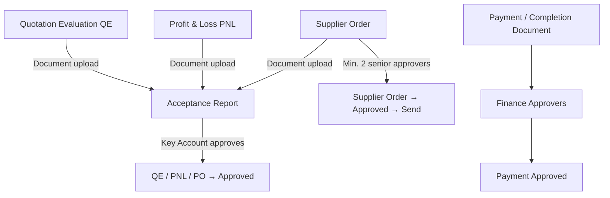
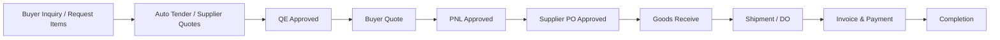
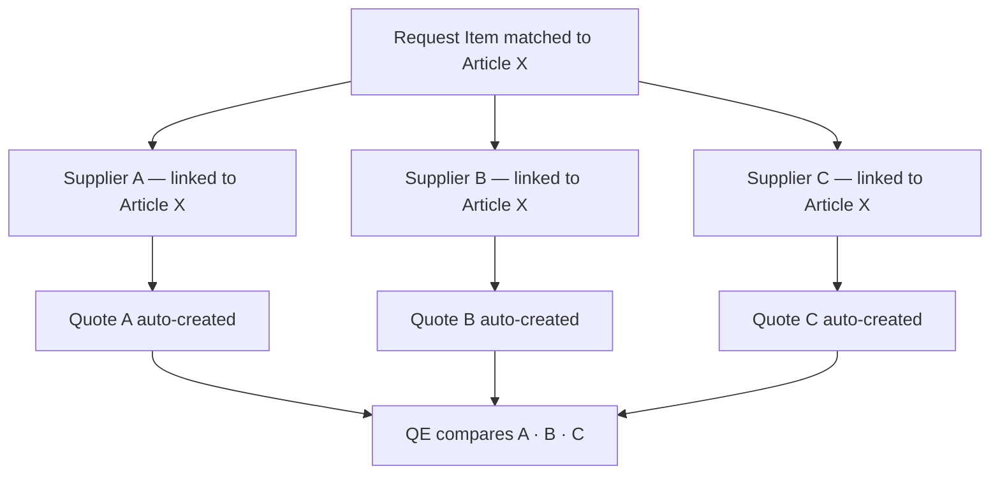
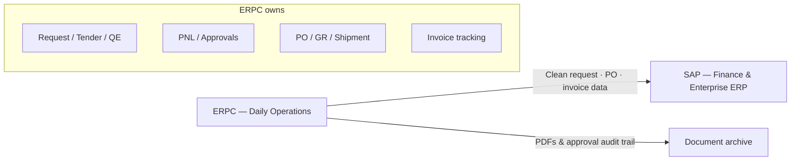

# ERPC — Enterprise Trading Platform

> Product & business reference for stakeholders, sales, and implementation teams.  
> Use alongside `README.md` for technical detail and the **Slide Appendix** at the end for PowerPoint.

---

## 1. Big Picture

### What ERPC Is

ERPC is a **procurement-focused B2B middleware** for trading companies — businesses that buy from multiple suppliers and sell to multiple buyers, often across currencies, with margin control and formal approval gates.

**Positioning in one sentence:** ERPC is the **operational layer for trading and procurement** — not a replacement for full corporate ERP, but the system teams actually use day-to-day for quotes, tenders, approvals, and documents **before** (or alongside) posting to SAP.

It unifies what trading firms typically run in separate tools:

| Fragmented approach | ERPC approach |
|---------------------|---------------|
| CRM in one system | CRM + trading workflow in one platform |
| Spreadsheets for margin / PNL | Built-in PNL with approval workflow |
| Email chains for QE & PO sign-off | Structured QE, PNL, and dual-approval supplier orders |
| Shared drives for documents | Generate PDF → re-upload for official records + Acceptance Report |
| Manual quote / invoice follow-up | Scheduled reminders (quotes, supplier responses, overdue invoices) |
| SAP too complex for daily CP work | **Bridge to SAP** — clean operational data, approvals, and documents first |

### ERPC vs SAP (High-Level)

| | ERPC | SAP |
|---|------|-----|
| **Role** | Procurement & trading operations middleware | Enterprise ERP backbone (FI, CO, MM, SD, …) |
| **Complexity** | Purpose-built for B2B trading flows | Broad; high setup and consulting cost |
| **Typical use** | Quote → tender → approve → order → ship → invoice | GL, consolidation, enterprise procurement at scale |
| **Relationship** | **Jembatan sebelum masuk SAP** — operational truth here; finance can post summaries to SAP | System of record for finance & large org structures |

> *SAP terlalu kompleks untuk operasional harian Central Purchasing. ERPC menangani alur procurement end-to-end; SAP tetap bisa jadi backbone keuangan perusahaan.*

### Who It Is For

- **Trading companies** sourcing from many suppliers and selling to many buyers
- **Central Purchasing (CP)** teams that prepare documents and route approvals
- **Key Account managers** responsible for buyer relationships and document acceptance
- **Senior management** (Dept Head, Deputy Director, Director) who approve QE, PNL, and supplier orders
- **Finance** teams approving payment / completion documents
- **Multi-team organizations** needing isolated workspaces with shared patterns

### One-Line Value Proposition

**One platform from buyer inquiry to payment — procurement B2B middleware with margin visibility, end-to-end approval, and a single Request as the operational hub.**

### Feature Themes (Quick Map)

| Theme | What ERPC delivers |
|-------|-------------------|
| **Middleware / B2B procurement** | Request-centric ops layer before or beside SAP |
| **Data entry** | Flexible numbering, quick vendor/item master, 1 article → many suppliers |
| **Project tracking** | Group requests; roll up purchase spend and revenue per project |
| **Quote → purchase E2E** | Quote · tender · approve · order · receive · ship · invoice — with approvals at each gate |
| **Auto tender** | One line-item inquiry → quotes auto-sent to all linked vendors |
| **Perpajakan (tax)** | PKP / non-PKP suppliers, per-line tax, multi-currency |
| **Documentation** | Generate PDF → re-upload signed copies for audit trail |
| **Service sales** | Service request type, child line items, acceptance reports |
| **Reminders** | Quote expiry, awaiting supplier quote, overdue invoices |

---

## 2. Business Flow

### End-to-End Trading Lifecycle

Every deal is tracked as a **Request**. The Request moves through controlled **stages**; tabs on the Request View unlock as work progresses and approvals are granted.

```mermaid
flowchart LR
    subgraph CRM["CRM & Master Data"]
        A[Buyer Inquiry / Opportunity]
        B[Companies · Articles · Projects]
    end

    subgraph Sourcing["Sourcing & Tender"]
        C[Request Created]
        D[Auto Tender → Supplier Quotes]
        E[Quotation Evaluation QE]
    end

    subgraph Sales["Sales & Margin"]
        F[Buyer Quote]
        G[Profit & Loss PNL]
    end

    subgraph Fulfillment["Orders & Logistics"]
        H[Buyer Order]
        I[Supplier Orders]
        J[Goods Receive]
        K[Inbound Shipment / DO]
    end

    subgraph Finance["Finance & Close"]
        L[Buyer & Supplier Invoices]
        M[Payments]
        N[Completion Report]
    end

    A --> B --> C --> D --> E
    E -->|Key Account + Senior Approval| F
    F -->|Buyer Accepts| G
    G -->|Approved| H --> I
    I -->|Dual Approval| J --> K --> L --> M --> N
```

### Request Stage Progression

Operational stages (system-enforced) map to the 8-tab Request View:

| Stage | Business meaning | Request View tab |
|-------|------------------|------------------|
| Draft | Intake, item matching | Requested Items |
| Awaiting Supplier Response | Collecting supplier prices | Supplier Quotes |
| Preparing Buyer Quote | Building sell-side offer | Buyer Quotes |
| Awaiting Buyer Confirmation | Buyer decision / PO | Buyer Quotes |
| Preparing Supplier Order | PO preparation | Purchases |
| Goods Receive | Inbound receipt | Goods Receive |
| Awaiting Shipment / Shipped / Delivered | Logistics | Inbound Shipments |
| Invoiced / Paid / Completed | Financial close | Invoices · Completion Report |

### Approval Gates (Control Points)

**Business rule:** Numbers and documents are not reused casually — sequences continue past soft-deleted records; uploaded documents require explicit acceptance before downstream status changes.

### Quote → Purchase Flow (End-to-End)

Operational language used by trading teams maps to ERPC as follows:

| Step | Business term | ERPC capability |
|------|---------------|-----------------|
| 1 | Inquiry | Request + matched items |
| 2 | Tender / RFQ | Auto-generated supplier quotes (multi-vendor per item) |
| 3 | Internal evaluation | Quotation Evaluation (QE) + senior approval |
| 4 | Offer to buyer | Buyer quote + margin |
| 5 | Margin sign-off | PNL + approval |
| 6 | Purchase | Buyer order + supplier PO (dual approval before send) |
| 7 | Receipt | Goods receive |
| 8 | Delivery | Inbound shipment + Delivery Order PDF |
| 9 | Billing | Buyer & supplier invoices, payment tracking |
| 10 | Close | Completion report + finance approval |

**Approval end-to-end:** QE · PNL · supplier PO (dual) · Acceptance Report (documents) · payment/completion (finance) — all on the same Request thread.

### Information Flow Widget

On the Request View page, a footer widget shows **step-by-step guidance for the active tab** (1–8). This reduces training burden and keeps CP teams aligned on what to do next without leaving the request context.

---

## 3. Advantages

### For the Business

| Advantage | What it means in practice |
|-----------|---------------------------|
| **Single source of truth** | One Request links items, quotes, orders, shipments, invoices, and documents |
| **Margin before commitment** | PNL groups cost by supplier with sell/margin analysis before orders are placed |
| **Controlled spending** | Supplier orders need dual senior approval before send |
| **Audit-ready** | Who approved QE, PNL, PO, and payment documents — with timestamps |
| **Faster onboarding** | Trading-specific UI vs configuring a generic ERP for months |
| **Lower TCO** | Modern Laravel stack; no SAP license / BASIS / ABAP overhead for core trading flows |
| **Multi-team ready** | Isolated workspaces per team with role-based access |
| **Proactive operations** | Quote expiry, supplier follow-up, overdue invoice reminders |
| **SAP bridge** | Run procurement in ERPC; SAP stays finance backbone when needed |

### For Central Purchasing

- Prepare QE and PNL from live request data — not re-keying from spreadsheets
- Upload supporting documents once; route through **Acceptance Report**
- Key Account role owns document acceptance for QE, PNL, and supplier order paperwork
- Supplier quote **auto-tender** when request moves to awaiting supplier response (multi-vendor per item)

### For Management

- Formal approval matrix: Dept Head of Sales, Deputy Director, Director
- PDF exports for QE, PNL, supplier PO, and Delivery Order
- Visibility into stage, margin, and outstanding approvals from one Request View

### For IT / Operations

- PostgreSQL, Filament admin, queue-ready jobs
- Import/export for master data and transactional exports (QE, PNL, quotes, orders)
- Custom fields without code changes
- Team SMTP, branded templates, test-before-send email setup

---

## 4. Business Point of View (POV)

### Trading Company Owner / GM

> *"I need to know we are not sending large POs without oversight, and that margin was reviewed before we commit."*

ERPC enforces **PNL approval** and **dual-approval supplier orders** as part of the normal workflow — not as optional policy on paper. Completion and payment documents go through **finance approvers**.

### Head of Central Purchasing

> *"My team lives in requests — from first buyer line item to final invoice."*

The **Request View** is the daily workspace. Eight tabs mirror how CP actually works. The **Information Flow** widget tells junior staff what the next step is per tab.

### Key Account Manager

> *"I own the buyer relationship and need to sign off on what goes out."*

Key Accounts approve QE, PNL, and supplier order documents via **Acceptance Report**. Buyer quote expiry notifications keep accounts proactive. **PIC contacts** on shipments flow to Delivery Order PDFs.

### Finance Controller

> *"Credit limits and payment documents need a clear trail."*

**Credit limit requests** use dual finance approval before limits change. **Payment documents** (completion reports) are approved separately in Acceptance Report. Invoice and payment tracking sit on the same request thread.

### Sales / Commercial

> *"I need CRM context and deal status without a separate CRM login."*

**People, Opportunities, Tasks, Notes**, and **AI summaries** sit beside trading data. Buyer companies link to contacts used across quotes, shipments, and CRM.

---

## 5. Detailed Features

### 5.1 Request Management

- Auto-generated request numbers (`{prefix}-{YYYY}-{NNNN}`), team-scoped, configurable prefix per team
- Stage machine with validation (e.g. all items matched before supplier quoting)
- Request types (**goods** / **service**) with item matching to article catalog
- **Project grouping** — link multiple requests to one project for consolidated tracking
- Priority, required-by dates, internal notes
- Financial roll-ups per request: buyer total, supplier cost, margin, cash flow indicators

### 5.2 Data Entry & Master Data Flexibility

Designed to reduce friction for CP teams who add vendors and items frequently:

| Need | ERPC approach |
|------|---------------|
| **Flexible numbering** | Auto-sequences for requests, projects, quotes, POs, invoices — team-configurable prefixes; sequences respect soft-deleted records |
| **Quick new vendor** | Create supplier from Filament; import/export CSV/Excel for bulk onboarding |
| **Quick new item** | Article catalog with auto code generation; import with column mapping |
| **1 item → multi vendor** | `supplier_articles` pivot: one article linked to many suppliers (active/preferred flags, last quoted price) |
| **Inline relationships** | Add companies, contacts, PIC from shipment and quote forms without leaving context |

**Business benefit:** Master data grows organically with deals — no waiting for a central MDM project before processing the next inquiry.

### 5.3 Auto Tender (Multi-Vendor Sourcing)

When a request advances to **Awaiting Supplier Response**, ERPC automatically:

1. Finds all **active** suppliers for each matched article (`supplier_articles`)
2. Creates **one supplier quote per vendor** covering all items that vendor can supply
3. Pre-fills pricing hints from last quoted price on the pivot
4. Can notify suppliers (email) for quote response

**Single item inquiry → multi-vendor tender** without manual RFQ duplication.

### 5.4 Project Tracking

Projects group related requests for **large or multi-phase deals**:

- Auto-generated project numbers (`PRJ-{YYYY}-{NNNN}`)
- Optional buyer, start/end dates, status, notes
- Multiple requests per project → **consolidated view of procurement and spend**
- Request-level financial roll-ups aggregate into project-level visibility (buyer revenue, supplier cost, margin across requests)

**Business POV:** *"Satu project, banyak request — semua pembelian dan pengeluaran terkumpul per proyek, bukan tersebar di spreadsheet."*

### 5.5 Supplier Quoting & Quotation Evaluation (QE)

**Supplier quoting**

- Auto-create supplier quotes when request advances from draft (per supplier–article relationship)
- Compare multiple supplier options on one request
- Document upload per supplier quote

**Quotation Evaluation**

- Internal comparison document: items, suppliers, commercial terms
- Multi-level approval (Key Account preparation + senior roles)
- PDF export and document upload
- Approved via Acceptance Report → status **Approved**

### 5.6 Buyer Quoting

- Consolidated buyer quote with margin view
- Payment terms validation (installments must total 100%)
- Prepayment: percentage or fixed amount with cross-validation
- Service items: parent **+Tax** syncs to child line items
- Buyer PO upload when quote is **Accepted**
- Quote expiry: UI warning, daily jobs (expiring 7/3/1 days; expired alerts to buyer + key accounts)

### 5.7 Profit & Loss (PNL)

- Line items grouped by supplier
- Cost · sell · margin analysis
- Same senior approval pattern as QE
- Document upload, PDF export, Acceptance Report approval

### 5.8 Orders

**Buyer orders**

- Created from accepted buyer quote path
- Order numbering and status tracking

**Supplier orders**

- One PO per supplier per request (suffix A, B, C…)
- Status: Draft → Confirmed → **Approved** (min. 2 approvers) → Sent → …
- PDF and email to supplier only after approval
- Approval section on PDF: checked by key account, two approvers, supplier signature line
- Tax-aware line totals for taxable suppliers

### 5.9 Goods Receive, Shipments, Invoicing

- Goods receive linked to request and supplier orders
- Inbound shipments with **Delivery Order (DO) PDF**
- PIC contact from buyer’s people — name and phone on DO
- Buyer and supplier invoices with payment tracking
- Completion report and payment document approval path

### 5.10 Perpajakan (Tax & Multi-Currency)

Supports Indonesian trading tax patterns and international deals:

| Concept | ERPC implementation |
|---------|---------------------|
| **PKP supplier** | Supplier `is_taxable = true` — line totals include tax; QE/PO PDFs show tax columns |
| **Non-PKP supplier** | `is_taxable = false` — tax-exempt treatment on supplier documents |
| **Per-line tax** | Tax codes on quote/order line items; buyer quote **+Tax** sync for service child lines |
| **Multi-currency** | Currencies + exchange rates; rates locked on orders; conversion service for reporting |
| **QE transparency** | Quotation Evaluation shows supplier taxable (PKP) flag per vendor |

**Business benefit:** Margin and PNL reflect real tax treatment per supplier before PO is sent — not adjusted manually in Excel after the fact.

### 5.11 Service Requests (Jual Jasa)

Goods and **service** requests follow different workflows:

| | Goods | Service |
|---|-------|---------|
| **Evaluation** | Quotation Evaluation (QE) | QE optional / streamlined path |
| **Item structure** | Flat line items | Main item + **child items** (detail breakdown) |
| **Fulfillment** | Goods receive + inbound shipment | **Acceptance reports** (upload PDF/Word/images) |
| **Buyer quote** | Standard lines | Parent +Tax syncs to child line totals |

**Example:** Main item "Preparation work" with child lines for mobilisation, project signs, etc. — only main item flows to supplier quotes; children provide commercial detail on buyer quote.

### 5.12 Documentation (Generate & Re-Upload)

Official documents follow a **generate → sign → re-upload** pattern:

| Document | Generate | Re-upload for records |
|----------|----------|----------------------|
| Quotation Evaluation | PDF download | Upload signed copy → Acceptance Report |
| Profit & Loss | PDF download | Upload signed copy → Acceptance Report |
| Supplier PO | PDF + email to supplier | Upload signed/ stamped copy |
| Delivery Order | PDF from shipment | Stored with shipment record |
| Buyer PO | — | Upload when buyer quote **Accepted** |
| Completion / payment | — | Upload → finance approval in Acceptance Report |

Dedicated storage per document type (Spatie Media Library); legacy paths remain backward compatible.

### 5.13 Acceptance Report (Approval Hub)

| Document type | Typical approver |
|---------------|------------------|
| QE / PNL / Supplier Order uploads | Key Account |
| Payment / completion documents | Finance (CP) |

Actions: view document, approve. Approval updates entity status and records approver + timestamp.

### 5.14 Master Data

| Entity | Purpose |
|--------|---------|
| Companies | Buyers and suppliers, credit limits, tax flags |
| Articles | Product catalog, supplier relationships |
| Projects | Group related requests |
| Currencies | Multi-currency with exchange rates |
| Tax codes | Per-line tax rules |
| People | Contacts linked to companies (CRM + PIC) |
| Team members | CP roles and approvers |

### 5.15 CRM

- People / contacts with company linkage
- Opportunities pipeline
- Tasks and notes on records
- AI-powered record summaries

### 5.16 Credit Limit Management

- Buyers request credit limit increases
- **Dual finance approval** required before active limit updates
- Available credit reduced on confirmed orders, restored on cancellation
- Email notifications to finance approvers

### 5.17 Reminders & Alerts

Proactive notifications so quotes, supplier responses, and invoices do not slip:

| Schedule | Job | Who is notified |
|----------|-----|-----------------|
| 08:00 daily | Expiring buyer quotes (7 / 3 / 1 days) | Quote creator |
| 08:30 daily | Expired buyer quotes (previous day) | Buyer + key accounts (email + in-app) |
| 09:00 daily | Overdue invoices | Invoice creator (`InvoiceOverdueNotification`) |
| 10:00 daily | Supplier quotes awaiting response (>7 days) | Request / quote creator |

**Dashboard widgets:** Awaiting payment (overdue highlight), expiring quotes, and related operational alerts on the home screen.

> *Invoice, quote, and supplier-follow-up reminders — tanpa follow-up manual di email.*

### 5.18 Platform & Automation

**Multi-team**

- Isolated workspace per team (tenant)
- Shared navigation; record-level permissions via policies

**Roles**

| Role | Access |
|------|--------|
| Administrator | Full access |
| Editor | Read, create, update |
| Central Purchasing | Read, create, update + sub-roles |

**CP sub-roles:** Key Account · Dept Head of Sales · Deputy Director · Director

**Email**

- Template library per document type with variables (`{{buyer_name}}`, `{{quote_number}}`, …)
- Team SMTP (encrypted), logo, signature, CC/BCC, test send

**Import / export**

| Import + export | Export only |
|-----------------|-------------|
| People, Buyers, Suppliers, Articles | QE, PNL, Buyer/Supplier Quotes, Buyer/Supplier Orders |

**Scheduled jobs** — see §5.17 Reminders & Alerts for full list.

**Documents** — see §5.12 Documentation.

---

## 6. Comparison to SAP

> SAP (e.g. S/4HANA with MM, SD, FI, CRM) is a **broad enterprise suite**. ERPC is **procurement-specific B2B middleware** for trading operations. The comparison below is from a **trading company business POV**, not a feature parity checklist.

### ERPC as SAP Bridge (Jembatan ke SAP)

Many trading companies already run or plan SAP for finance and enterprise reporting. ERPC does not try to replace that on day one:

| Layer | System | Responsibility |
|-------|--------|----------------|
| **Operational** | ERPC | Quote, tender, approve, order, ship, document, margin |
| **Financial backbone** | SAP (optional) | GL, AP/AR posting, consolidation, enterprise reporting |
| **Why both** | — | SAP terlalu kompleks untuk alur harian CP; ERPC cepat dipakai, SAP tetap jadi system of record keuangan |

### Positioning Summary

| Dimension | SAP (typical) | ERPC |
|-----------|---------------|------|
| **Scope** | Full enterprise ERP (finance, HR, manufacturing, etc.) | Procurement B2B middleware + CRM + approvals |
| **Role in landscape** | System of record for finance & large org | **Bridge before SAP** — operational truth for trading |
| **Time to value** | Months–years of blueprinting, modules, integration | Weeks–months for core trading flows |
| **Cost model** | Licenses, implementation partners, ongoing BASIS/consulting | Application hosting + lean implementation |
| **Trading workflow** | Built from SD/MM/FI + custom workflows | Native Request-centric flow + auto tender |
| **QE / PNL as documents** | Usually custom forms / third-party or spreadsheets | First-class entities with PDF + approval |
| **CP approval matrix** | Workflow in SAP Business Workflow / BTP — project-specific | Built-in: QE, PNL, dual PO, Acceptance Report |
| **Margin analysis** | Often report-based or external | On-request PNL before order placement |
| **CRM** | SAP Sales Cloud / separate CRM license | Included: people, opportunities, tasks, notes |
| **Customization** | ABAP, Fiori, consulting-heavy | Laravel/Filament, faster iteration |
| **Multi-entity / team** | Company codes, plants, sales orgs | Team workspaces with ERP settings per team |

### Where SAP Is Stronger

- **Global enterprise scale** — thousands of users, complex org structures, intercompany
- **Deep finance** — full GL, consolidation, treasury, tax engines per country
- **Manufacturing & inventory** — MRP, production orders, warehouse management at scale
- **Ecosystem** — decades of integrators, industry solutions, compliance packages
- **Procurement at enterprise scale** — SRM, catalog management, contract lifecycle at Fortune 500 depth

### Where ERPC Is Stronger (for trading firms)

- **SAP bridge / middleware** — run procurement here; post to SAP when ready
- **Auto tender** — one inquiry, many vendors, no duplicate RFQ entry
- **Request as single operational hub** — not spreading a deal across SAP transaction codes
- **Trading-native approvals** — QE, PNL, supplier PO dual approval without a workflow project
- **Quote-to-margin path** — supplier quotes → QE → buyer quote → PNL in one UI
- **Document generate + re-upload** — Acceptance Report aligned to how CP teams actually work
- **PKP / non-PKP + multi-currency** — tax-aware quotes and POs per supplier
- **Service workflow** — jual jasa with child items and acceptance reports
- **Reminders** — quotes, supplier follow-up, overdue invoices without SAP batch config
- **Agility** — new fields, exports, email templates without ABAP release cycles
- **Right-sized for mid-market traders** — not paying for unused SAP modules

### Typical Migration / Coexistence Story

| Scenario | Approach |
|----------|----------|
| Greenfield trader | ERPC as primary operations system |
| **SAP already in place** | **ERPC = jembatan operasional**; SAP for GL/AP/AR; ERPC for request-to-PO |
| SAP for GL, ERPC for trading ops | ERPC owns request-to-PO; finance posts summaries to SAP |
| Spreadsheet replacement | ERPC replaces QE/PNL/quote trackers first |
| CRM replacement | ERPC CRM + trading avoids separate Salesforce + ops tools |

**Business takeaway:** Choose SAP when the organization is a **full ERP enterprise** with complex finance and supply chain at global scale. Choose ERPC when the priority is **procurement B2B execution, auto tender, margin control, and CP approvals** — as the daily operations layer, with or without SAP behind it.

---

## 7. Technology Stack (Summary)

| Layer | Technology |
|-------|------------|
| Backend | PHP 8.4 · Laravel 12 |
| Admin UI | Filament 5 · Livewire 4 |
| Database | PostgreSQL 15+ |
| Frontend | Tailwind CSS 4 |
| Queue | Redis (optional) |

---

## 8. Summary

| Capability | Benefit |
|------------|---------|
| Procurement B2B middleware (SAP bridge) | Daily ops without SAP complexity |
| End-to-end quote → purchase flow | Tender through completion on one Request |
| Auto tender (1 item, multi-vendor) | Faster sourcing, less manual RFQ |
| QE · PNL · dual supplier PO approval | Financial and commercial control |
| PKP / non-PKP · multi-currency | Tax-aware trading documents |
| Generate PDF + re-upload | Audit trail for signed documents |
| Service requests (jual jasa) | Goods and services in one platform |
| Project grouping | Purchases and spend rolled up per project |
| Reminders (quote · supplier · invoice) | Proactive follow-up |
| Acceptance Report | Central document approval for CP and finance |
| CRM + master data | Relationships and catalog beside transactions |
| Multi-team · roles · email automation | Secure, branded operations |
| Import/export | Data mobility and reduced manual entry |

**Closing line:** *Procurement middleware for trading companies — from inquiry to payment, with auto tender, approvals, and margin visibility — as the bridge to enterprise ERP when you need it.*

---

## Suggested Deck Outline (~21 slides)

Use sections 1–6 above as speaker source. Suggested slide mapping:

| # | Title | Source section |
|---|-------|----------------|
| 1 | Title | §1 Big Picture |
| 2 | What is ERPC? (Middleware / B2B) | §1 |
| 3 | Who is it for? | §1 |
| 4 | End-to-end lifecycle (diagram) | §2 Business Flow |
| 5 | Quote → Purchase E2E | §2 Quote → Purchase Flow |
| 6 | Request Management | §5.1 |
| 7 | Data Entry & Master Data | §5.2 |
| 8 | Auto Tender | §5.3 |
| 9 | Project Tracking | §5.4 |
| 10 | Supplier Quoting & QE | §5.5 |
| 11 | Buyer Quoting & PNL | §5.6 · §5.7 |
| 12 | Orders & Approvals | §5.8 |
| 13 | Perpajakan & Multi-Currency | §5.10 |
| 14 | Service (Jual Jasa) | §5.11 |
| 15 | Documentation (Generate & Re-Upload) | §5.12 |
| 16 | Acceptance Report | §5.13 |
| 17 | Reminders & Alerts | §5.17 |
| 18 | CRM & Master Data | §5.14 · §5.15 |
| 19 | ERPC vs SAP (Bridge) | §6 |
| 20 | Technology Stack | §7 |
| 21 | Summary / Q&A | §8 |

**Design tips:** One idea per slide; max 5–6 bullets; use §2 mermaid diagrams as PPT process graphics; optional appendix for full role matrix and credit limit flow (`docs/credit-limit-request-flow.md`).

---

## License

AGPL-3.0
