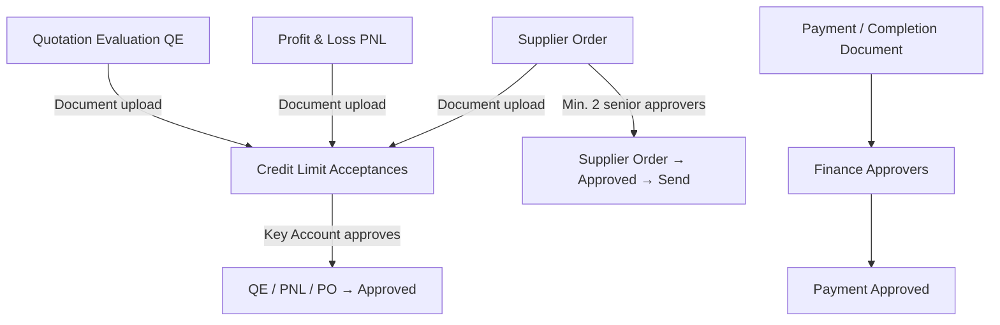
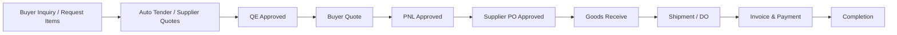
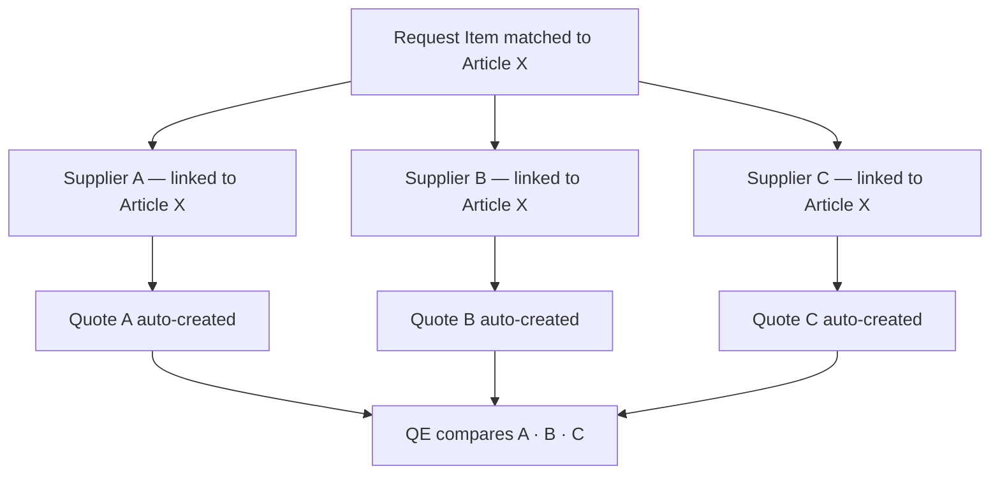
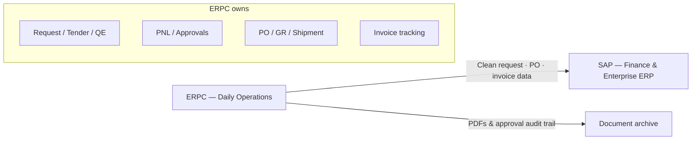

# ERPC — Enterprise Trading Platform

> Product & business reference for stakeholders, sales, and implementation teams.  
> Use alongside `README.md` for technical detail. **§6** = who/when/why per feature. **§11** = verified vs planned gaps.  
> **17-slide AI deck:** [`docs/DECK_17_SLIDES.md`](docs/DECK_17_SLIDES.md)

---

## 1. Big Picture

### What ERPC Is

ERPC is a **procurement-focused B2B middleware** for trading companies — businesses that buy from multiple suppliers and sell to multiple buyers, often across currencies, with margin control and formal approval gates.

**Positioning in one sentence:** ERPC is the **operational layer for trading and procurement** — not a replacement for full corporate ERP, but the system teams actually use day-to-day for quotes, tenders, approvals, and documents **before** (or alongside) posting to SAP.

It unifies what trading firms typically run in separate tools:

| Fragmented approach | ERPC approach |
|---------------------|---------------|
| Buyer/supplier email back-and-forth | **Buyer & supplier portals** + internal app on one platform |
| Public RFQ via phone/email | **Public catalog** with quote cart → request |
| Spreadsheets for margin / PNL | Built-in PNL with approval workflow |
| Email chains for QE & PO sign-off | Structured QE, PNL, and dual-approval supplier orders |
| Shared drives for documents | Generate PDF → re-upload for official records + Credit Limit Acceptances |
| Manual quote / invoice follow-up | Scheduled reminders (quotes, supplier responses, overdue invoices, catalog price review) |
| SAP too complex for daily CP work | **Bridge to SAP** — clean operational data, approvals, and documents first |

### ERPC vs SAP (High-Level)

| | ERPC | SAP |
|---|------|-----|
| **Role** | Procurement & trading operations middleware | Enterprise ERP backbone (FI, CO, MM, SD, …) |
| **Complexity** | Purpose-built for B2B trading flows | Broad; high setup and consulting cost |
| **Typical use** | Quote → tender → approve → order → ship → invoice | GL, consolidation, enterprise procurement at scale |
| **Relationship** | **Jembatan sebelum masuk SAP** — operational truth here; finance can post summaries to SAP | System of record for finance & large org structures |

> *SAP terlalu kompleks untuk operasional harian Central Purchasing. ERPC menangani alur procurement end-to-end; SAP tetap bisa jadi backbone keuangan perusahaan.*

### Who It Is For

- **Trading companies** sourcing from many suppliers and selling to many buyers
- **Central Purchasing (CP)** teams that prepare documents and route approvals
- **Key Account managers** responsible for buyer relationships and document acceptance
- **Senior management** (Dept Head, Deputy Director, Director) who approve QE, PNL, and supplier orders
- **Finance** teams approving payment / completion documents
- **Buyers and suppliers** using self-service portals for requests, quotes, RFQs, and article pricing
- **Multi-team organizations** needing isolated workspaces with shared patterns

### One-Line Value Proposition

**One platform from buyer inquiry to payment — procurement B2B middleware with margin visibility, end-to-end approval, and a single Request as the operational hub.**

### Feature Themes (Quick Map)

| Theme | What ERPC delivers |
|-------|-------------------|
| **Middleware / B2B procurement** | Request-centric ops layer before or beside SAP |
| **Data entry** | Flexible numbering, quick vendor/item master, 1 article → many suppliers |
| **Project tracking** | Group requests; roll up purchase spend and revenue per project |
| **Quote → purchase E2E** | Quote · tender · approve · order · receive · ship · invoice — with approvals at each gate |
| **Auto tender** | One line-item inquiry → quotes auto-sent to all linked vendors |
| **Perpajakan (tax)** | PKP / non-PKP suppliers, per-line tax, multi-currency |
| **Documentation** | Generate PDF → re-upload signed copies for audit trail |
| **Service sales** | Service request type, child line items, acceptance reports |
| **Portals & catalog** | Buyer portal, supplier portal, public catalog storefront |
| **Reminders** | Quote expiry, awaiting supplier quote, overdue invoices, catalog price review |

---

## 2. Business Flow

### End-to-End Trading Lifecycle

Every deal is tracked as a **Request**. The Request moves through controlled **stages**; tabs on the Request View unlock as work progresses and approvals are granted.

```mermaid
flowchart LR
    subgraph CRM["Inquiry & Master Data"]
        A[Buyer Inquiry / Catalog / Portal]
        B[Buyers · Suppliers · Articles · Projects]
    end

    subgraph Sourcing["Sourcing & Tender"]
        C[Request Created]
        D[Auto Tender → Supplier Quotes]
        E[Quotation Evaluation QE]
    end

    subgraph Sales["Sales & Margin"]
        F[Buyer Quote]
        G[Profit & Loss PNL]
    end

    subgraph Fulfillment["Orders & Logistics"]
        H[Buyer Order]
        I[Supplier Orders]
        J[Goods Receive]
        K[Fulfillment — Shipment / DO · Acceptance Reports]
    end

    subgraph Finance["Finance & Close"]
        L[Buyer & Supplier Invoices]
        M[Payments]
        N[Completion Report]
    end

    A --> B --> C --> D --> E
    E -->|Key Account + Senior Approval| F
    F -->|Buyer Accepts| G
    G -->|Approved| H --> I
    I -->|Dual Approval| J --> K --> L --> M --> N
```

### Request Stage Progression

The system defines **13 stages** (`RequestStage` enum). The **Request View** consolidates daily work into **8 tabs**; clicking a tab can auto-advance the stage forward when business rules pass.

| Stage | Phase | Request View tab |
|-------|-------|------------------|
| Draft | Sourcing | Requested Items |
| Awaiting Supplier Response | Sourcing | Supplier Quotes |
| Preparing Buyer Quote | Quoting | Buyer Quotes |
| Awaiting Buyer Confirmation | Quoting | Buyer Quotes |
| Preparing Supplier Order | Ordering | Purchases (Supplier Orders) |
| Goods Receive | Ordering | Goods Receive |
| Awaiting Shipment / Shipped / Delivered | Delivery | Fulfillment *(shipments for goods; acceptance reports for services)* |
| Invoiced / Paid / Completed | Closing | Invoices *(buyer orders)* · Completion Report |
| Cancelled | — | — |

**Tab access gates (enforced in UI):**

| Gate | Rule |
|------|------|
| QE approved | Tabs after Supplier Quotes require **Quotation Evaluation approved** (or obtained+selected supplier quote bypass) |
| PNL approved | Tabs from Invoices through Completion require **Profit & Loss approved** |
| Accepted buyer quote | Same tabs require at least one **Accepted** buyer quote; no quotes left in **Sent** without PO upload |
| Goods receive docs | Fulfillment tab blocked until goods-receive documents are approved (goods requests) |
| Service vs goods | **Fulfillment** shows inbound shipments for goods and acceptance reports for services; mixed requests show both |

**Footer widget:** `RequestInformationFlowWidget` shows per-tab guidance (steps 1–8) at the bottom of Request View.

### Approval Gates (Control Points)

**Business rule:** Numbers and documents are not reused casually — sequences continue past soft-deleted records; uploaded documents require explicit acceptance before downstream status changes.

### Quote → Purchase Flow (End-to-End)

Operational language used by trading teams maps to ERPC as follows:

| Step | Business term | ERPC capability |
|------|---------------|-----------------|
| 1 | Inquiry | Request + matched items |
| 2 | Tender / RFQ | Auto-generated supplier quotes (multi-vendor per item) |
| 3 | Internal evaluation | Quotation Evaluation (QE) + senior approval |
| 4 | Offer to buyer | Buyer quote + margin |
| 5 | Margin sign-off | PNL + approval |
| 6 | Purchase | Buyer order + supplier PO (dual approval before send) |
| 7 | Receipt | Goods receive |
| 8 | Delivery | Fulfillment — inbound shipment + DO PDF (goods) or acceptance report (services) |
| 9 | Billing | Buyer & supplier invoices, payment tracking |
| 10 | Close | Completion report + finance approval |

**Approval end-to-end:** QE · PNL · supplier PO (dual) · Credit Limit Acceptances (documents) · payment/completion (finance) — all on the same Request thread.

### Information Flow Widget

On the Request View page, a footer widget shows **step-by-step guidance for the active tab** (1–8). This reduces training burden and keeps CP teams aligned on what to do next without leaving the request context.

---

## 3. Advantages

### For the Business

| Advantage | What it means in practice |
|-----------|---------------------------|
| **Single source of truth** | One Request links items, quotes, orders, shipments, invoices, and documents |
| **Margin before commitment** | PNL groups cost by supplier with sell/margin analysis before orders are placed |
| **Controlled spending** | Supplier orders need dual senior approval before send |
| **Audit-ready** | Who approved QE, PNL, PO, and payment documents — with timestamps |
| **Faster onboarding** | Trading-specific UI vs configuring a generic ERP for months |
| **Lower TCO** | Modern Laravel stack; no SAP license / BASIS / ABAP overhead for core trading flows |
| **Multi-team ready** | Isolated workspaces per team with role-based access |
| **Proactive operations** | Quote expiry, supplier follow-up, overdue invoice reminders |
| **SAP bridge** | Run procurement in ERPC; SAP stays finance backbone when needed |

### For Central Purchasing

- Prepare QE and PNL from live request data — not re-keying from spreadsheets
- Upload supporting documents once; route through **Credit Limit Acceptances**
- Key Account role owns document acceptance for QE, PNL, and supplier order paperwork
- Supplier quote **auto-tender** when request moves to awaiting supplier response (multi-vendor per item)

### For Management

- Formal approval matrix: Dept Head of Sales, Deputy Director, Director
- PDF exports for QE, PNL, supplier PO, and Delivery Order
- Visibility into stage, margin, and outstanding approvals from one Request View

### For IT / Operations

- PostgreSQL, Filament admin, queue-ready jobs
- Import/export for master data and transactional exports (QE, PNL, quotes, orders)
- Custom fields without code changes
- Team SMTP, branded templates, test-before-send email setup

---

## 4. Business Point of View (POV)

### Trading Company Owner / GM

> *"I need to know we are not sending large POs without oversight, and that margin was reviewed before we commit."*

ERPC enforces **PNL approval** and **dual-approval supplier orders** as part of the normal workflow — not as optional policy on paper. Completion and payment documents go through **finance approvers**.

### Head of Central Purchasing

> *"My team lives in requests — from first buyer line item to final invoice."*

The **Request View** is the daily workspace. Eight tabs mirror how CP actually works. The **Information Flow** widget tells junior staff what the next step is per tab.

### Key Account Manager

> *"I own the buyer relationship and need to sign off on what goes out."*

Key Accounts approve QE, PNL, and supplier order documents via **Credit Limit Acceptances**. Buyer quote expiry notifications keep accounts proactive. **PIC contacts** on shipments flow to Delivery Order PDFs.

### Finance Controller

> *"Credit limits and payment documents need a clear trail."*

**Credit limit requests** use dual finance approval before limits change. **Payment documents** (completion reports) are approved separately in Credit Limit Acceptances. Invoice and payment tracking sit on the same request thread.

### Sales / Commercial

> *"Buyers and suppliers need self-service without losing control."*

**Buyer portal** for request tracking, quotes, invoices, and shipments. **Supplier portal** for RFQ response and article pricing. **Public catalog** for published articles and quote-cart submissions. **People** and **AI summaries** provide contact context across buyers, suppliers, quotes, and shipments.

---

## 5. Detailed Features

> **Capabilities** are listed in subsections below. For **who uses each feature, when in the workflow, and why**, see **§6 Feature Usage Guide**.

### 5.1 Request Management

- Auto-generated request numbers (`{prefix}-{YYYY}-{NNNN}`), team-scoped, configurable prefix per team
- **13 lifecycle stages** with forward-only tab advancement on Request View
- Request types (**goods** / **service**) — different tabs and line-item rules
- Item matching to **articles** required before supplier quoting (`all_items_matched`)
- **Project grouping** — link multiple requests to one project
- Priority (`RequestPriority`), required-by dates, internal notes, custom fields
- Soft delete with number sequencing that includes trashed records
- Financial accessors on model: buyer total, supplier cost, margin %, cash flow, expected vs actual
- Global search on request number + description
- Relation managers on resource: items, quotes, orders, shipments, acceptance reports (service)
- **Submission sources** — internal app, buyer portal, supplier portal, or public catalog (`RequestSubmissionMethod`)

### 5.2 Data Entry & Master Data Flexibility

Designed to reduce friction for CP teams who add vendors and items frequently:

| Need | ERPC approach |
|------|---------------|
| **Flexible numbering** | Auto-sequences for requests, projects, quotes, POs, invoices — team-configurable prefixes; sequences respect soft-deleted records |
| **Quick new vendor** | Create supplier from Filament; import/export CSV/Excel for bulk onboarding |
| **Quick new item** | Article catalog with auto code generation; import with column mapping |
| **1 item → multi vendor** | `supplier_articles` pivot: one article linked to many suppliers (active/preferred flags, last quoted price) |
| **Inline relationships** | Add companies, contacts, PIC from shipment and quote forms without leaving context |

**Business benefit:** Master data grows organically with deals — no waiting for a central MDM project before processing the next inquiry.

### 5.3 Auto Tender (Multi-Vendor Sourcing)

When a request advances to **Awaiting Supplier Response**, ERPC automatically:

1. Finds all **active** suppliers for each matched article (`supplier_articles`)
2. Creates **one supplier quote per vendor** covering all items that vendor can supply
3. Pre-fills pricing hints from last quoted price on the pivot
4. Can notify suppliers (email) for quote response

**Single item inquiry → multi-vendor tender** without manual RFQ duplication.

### 5.4 Project Tracking

Projects group related requests for **large or multi-phase deals**:

- Auto-generated project numbers (`PRJ-{YYYY}-{NNNN}`)
- Optional buyer, start/end dates, status, notes
- Multiple requests per project → **consolidated view of procurement and spend**
- Request-level financial roll-ups aggregate into project-level visibility (buyer revenue, supplier cost, margin across requests)

**Business POV:** *"Satu project, banyak request — semua pembelian dan pengeluaran terkumpul per proyek, bukan tersebar di spreadsheet."*

### 5.5 Supplier Quoting & Quotation Evaluation (QE)

**Supplier quoting** (`SupplierQuotesRelationManager`)

- Auto-create via `GenerateSupplierQuotesForRequest` when request leaves Draft
- Manual add supplier quote; resend email to suppliers
- Per-quote: currency, payment terms repeater, validity, job progress (service)
- Copy prices from `supplier_articles.last_quoted_price`
- Status: pending, selected, rejected, expired, …
- Email supplier (`QuoteToSupplierMail`)
- Document upload per quote
- Service: quote line structure mirrors main/child items

**Quotation Evaluation** (`QuotationEvaluationResource` + create from Request View)

- Auto-numbered QE document; links request + selected supplier quotes
- Supplier comparison table (price, lead time, PKP flag, payment terms)
- Approval personnel on document (Key Account, Dept Head, Deputy, Director)
- Status: need approval → approved (via Credit Limit Acceptances or workflow)
- PDF export; document upload
- List under **Approval → Quotation Evaluations**; bulk export

### 5.6 Buyer Quoting

**Buyer quotes** (`BuyerQuotesRelationManager`)

- Create from scratch or **copy from supplier quote** (margin, terms, items)
- Multi-currency; validity date; status: draft → sent → accepted / rejected / expired
- **Margin** fields and team default margin % from settings
- Payment terms repeater — must total **100%** with prepayment rules
- Prepayment: percentage or fixed; cross-validated with installment %
- **Credit status** buyers: stricter payment-term validation
- Service: **+Tax** on parent syncs to child line totals
- Service: detail/child line items on quote
- Send quote email to buyer (`QuoteToBuyerMail`); PDF download
- **Buyer PO upload** when status = Accepted (media collection)
- Expired quote alert component on view; scheduled expiry notifications
- Buyer quote extensions model for revision tracking
- Custom fields supported

### 5.7 Profit & Loss (PNL)

- Line items grouped by supplier
- Cost · sell · margin analysis
- Same senior approval pattern as QE
- Document upload, PDF export, Credit Limit Acceptances approval

### 5.8 Orders & Buyer Orders (UI tab: “Invoices”)

**Buyer orders** (`BuyerOrdersRelationManager` — tab label **Invoices**)

- Created from accepted buyer quote
- Auto-generated order number (`BO-{YYYY}-{NNNN}`)
- Status workflow: draft → confirmed → …
- Email buyer (`BuyerOrderToBuyerMail`) with PDF
- PDF download (`generateBuyerOrderPdf`)
- Payment terms displayed from source quote (prepayment %, days, description)
- Custom fields supported

**Supplier orders** (`SupplierOrdersRelationManager` — tab **Purchases**)

- One PO per supplier per request (suffix `-A`, `-B`, …)
- Status: Draft → Confirmed → **Approved** (min. 2 approvers) → Sent → Shipped → Delivered → Cancelled
- Create from buyer order / supplier quote path
- PDF + email to supplier **only after** dual approval (`PurchaseOrderToSupplierMail`)
- PDF approval block: Key Account (checked by) + 2 approvers + supplier signature line
- Tax-aware line totals when supplier `is_taxable`
- Document upload → **Credit Limit Acceptances** (Key Account)
- Dedicated **Approval → Supplier Orders** list for approvers

### 5.9 Goods Receive, Fulfillment & Completion

**Goods receive** (`GoodsReceiveRelationManager`)

- Batch document upload per supplier order
- Linked to request + supplier PO
- **Approval → Goods Receive** menu — finance/key-account style document approval via `PaymentDocumentApproval`
- Must be approved before Fulfillment unlocks (goods requests)

**Fulfillment** (`RelationGroup` on Request View — tab **Fulfillment**)

Groups goods and service delivery in one tab:

- **Inbound shipments** (`ShipmentsRelationManager`) — goods requests

- Created per supplier order; types and status tracking (`ShipmentStatus`)
- **Delivery Order (DO) PDF** (`generateShipmentDeliveryOrderPdf`) — Roman month format
- **PIC contact** from buyer’s People — name + phone on DO
- Email shipment to buyer (`ShipmentToBuyerMail`)
- `do_sent_at` tracking
- **Acceptance reports** (`AcceptanceReportsRelationManager`) — service requests
  - Report number `AR-{YYYY}-{NNNN}`, file uploads (PDF/Word/images)
  - Mixed requests show both shipment and acceptance-report channels

**Completion report** (`CompletionReportsRelationManager`)

- Upload completion documents to request media collection
- Mark as **payment document** with payment-term key (`due_days-percentage`)
- Payment documents approved in **Credit Limit Acceptances** by **Finance** role
- Request View shows payment-term paid/not-paid matrix (invoices + approved payment docs)

### 5.9b Invoicing & Payments (backend + widgets)

| Capability | UI today | Backend |
|------------|----------|---------|
| Buyer invoices (`BuyerInvoice`) | Tracked on dashboard widgets; payment status on Request View | Model, observer, overdue job — **no standalone Filament invoice CRUD yet** |
| Buyer payments (`BuyerPayment`) | — | Model + observer (auto numbering) |
| Supplier invoices (`SupplierInvoice`) | — | Model + policies |
| Supplier payments (`SupplierPayment`) | — | Model + observer |
| Credit limit transactions | **Finance → Credit Limits** (`BuyerCreditLimitOverviewResource`) | Per-buyer limit, used, available, pending requests |

**Practical invoicing today:** Buyer order tab (“Invoices”) + completion/payment documents + dashboard **Awaiting Payment** / **Monthly Revenue** widgets.

### 5.10 Perpajakan (Tax & Multi-Currency)

Supports Indonesian trading tax patterns and international deals:

| Concept | ERPC implementation |
|---------|---------------------|
| **PKP supplier** | Supplier `is_taxable = true` — line totals include tax; QE/PO PDFs show tax columns |
| **Non-PKP supplier** | `is_taxable = false` — tax-exempt treatment on supplier documents |
| **Per-line tax** | Tax codes on quote/order line items; buyer quote **+Tax** sync for service child lines |
| **Multi-currency** | Currencies + exchange rates; rates locked on orders; conversion service for reporting |
| **QE transparency** | Quotation Evaluation shows supplier taxable (PKP) flag per vendor |

**Business benefit:** Margin and PNL reflect real tax treatment per supplier before PO is sent — not adjusted manually in Excel after the fact.

### 5.11 Service Requests (Jual Jasa)

Goods and **service** requests follow different workflows:

| | Goods | Service |
|---|-------|---------|
| **Evaluation** | Quotation Evaluation (QE) | QE optional / streamlined path |
| **Item structure** | Flat line items | Main item + **child items** (detail breakdown) |
| **Fulfillment** | Goods receive + inbound shipment | **Acceptance reports** (within Fulfillment tab) |
| **Buyer quote** | Standard lines | Parent +Tax syncs to child line totals |

**Example:** Main item "Preparation work" with child lines for mobilisation, project signs, etc. — only main item flows to supplier quotes; children provide commercial detail on buyer quote.

### 5.12 Documentation (Generate & Re-Upload)

Official documents follow a **generate → sign → re-upload** pattern:

| Document | Generate | Re-upload for records |
|----------|----------|----------------------|
| Quotation Evaluation | PDF download | Upload signed copy → Credit Limit Acceptances |
| Profit & Loss | PDF download | Upload signed copy → Credit Limit Acceptances |
| Supplier PO | PDF + email to supplier | Upload signed/ stamped copy |
| Delivery Order | PDF from shipment | Stored with shipment record |
| Buyer PO | — | Upload when buyer quote **Accepted** |
| Completion / payment | — | Upload → finance approval in Credit Limit Acceptances |

Dedicated storage per document type (Spatie Media Library); legacy paths remain backward compatible.

### 5.13 Credit Limit Acceptances & Approval Menus

Two different “acceptance” concepts:

| Menu | Model / source | Approver | Purpose |
|------|----------------|----------|---------|
| **Approval → Credit Limit Acceptances** | Media on QE, PNL, Supplier PO, payment docs | Key Account (QE/PNL/PO) · Finance (payment docs) | Document sign-off; sets entity **Approved** |
| **Approval → Goods Receive** | `GoodsReceiveBatch` uploads | Per approval policy | GR document approval |
| **Approval → Quotation Evaluations** | `QuotationEvaluation` | Senior CP roles + document flow | QE list, export, view |
| **Approval → Profit & Loss** | `ProfitAndLoss` | Senior CP roles + document flow | PNL list, export, view |
| **Approval → Supplier Orders** | `SupplierOrder` (confirmed) | Dept Head / Deputy / Director (×2) | Dual PO approval before send |
| **Approval → Credit Limit Requests** | `BuyerCreditLimitRequest` | Finance (×2) | Credit limit increase |
| **Approval → Registrations** | `PortalRegistrationRequest` | CP / admin | Public catalog buyer signup |

**Credit Limit Acceptances columns:** status, source (QE/PNL/PO number), request number, buyer, payment terms, uploaded/approved timestamps. Row actions: View Document, Approve.

**QE / PNL senior workflow:** On status → Need Approval, email sent to eligible approvers (`QuotationEvaluationApprovalRequestMail`, `ProfitAndLossApprovalRequestMail`). Final document approval via Credit Limit Acceptances sets status **Approved**.

### 5.14 Master Data

| Entity | Menu | Key fields / behaviour |
|--------|------|------------------------|
| **Buyers** | Master Data → Buyers | Credit limit, available credit, key accounts, portal users, import/export |
| **Suppliers** | Master Data → Suppliers | `is_taxable` (PKP), delivery terms, portal users, import/export |
| **People** | Master Data → People | Contacts linked to buyers/suppliers; import/export, custom fields |
| **Articles** | Master Data → Articles | Code auto-gen, `supplier_articles` pivot, public catalog pricing, import/export, custom fields |
| **Categories** | Master Data → Categories | Tag-based classification (`TagResource`) |
| **Currencies** | Settings → Currencies | Default currency per team |
| **Exchange rates** | Settings → Exchange Rates | Rate history; locked on orders |
| **Tax codes** | Settings → Tax Codes | Per-line tax rules |
| **Unit of measures** | Settings → Unit of Measures | UoM for items |
| **Projects** | Workflow → Projects | Group requests; auto `PRJ-{YYYY}-{NNNN}` |
| **Members** | *(ungrouped)* | Administrator / Editor / Central Purchasing + sub-roles |

### 5.15 People & AI Summaries

| Feature | Detail |
|---------|--------|
| **People / contacts** | Name, phone, email; optional company links; reused as PIC on shipments |
| **AI summaries** | `RecordSummaryService` — AI-generated summaries for People and Companies (Prism) |
| **Custom fields** | Relaticle Custom Fields on People, BuyerQuote, BuyerOrder, Project, Articles, etc. |

> **Retired CRM entities:** Opportunities, Tasks, and Notes were removed (July 2026). Deal tracking lives on the Request workflow.

### 5.16 Public Catalog

- **Storefront** — when `CATALOG_ENABLED=true` (default), `/` shows published articles (`CatalogHome` Livewire)
- **Article publishing** — **Show in Catalog** + **List Price** on `ArticleResource`; `SuggestArticleListPrice` action from preferred supplier cost
- **Quote cart** — session cart at `/quote-cart`; `SubmitQuoteCart` creates a portal-originated request
- **Registration** — `/registration` creates pending `PortalRegistrationRequest` for team approval
- **Price review** — daily `articles:refresh-price-review` (07:00) flags stale list prices after FX/cost drift
- **Configuration** — `config/catalog.php`: `CATALOG_ENABLED`, `CATALOG_TEAM_ID`

### 5.17 Buyer Portal

- Filament **customer** panel at `CUSTOMER_PATH` (default `buyer`); separate session cookie (`CUSTOMER_PORTAL_ENABLED` kill switch)
- **Dashboard** — action items, request overview, active shipments, recent requests
- **Requests** — `CustomerRequestResource` with buyer quotes, invoices, shipments relation managers
- **Portal users** — invite/manage from **Master Data → Buyers → Portal Users** (`PortalUsersRelationManager`)
- **Registration approval** — **Approval → Registrations** (`PortalRegistrationRequestResource`)

### 5.18 Supplier Portal

- Filament **supplier** panel at `SUPPLIER_PATH` (default `supplier`); separate session cookie (`SUPPLIER_PORTAL_ENABLED` kill switch)
- **Dashboard** — stale prices, open RFQs, RFQ outcome widgets
- **Quote Requests** — `SupplierRfqResource`; confidentiality via query scope, policy, and column projection
- **My Articles** — `SupplierArticleResource` for offer pricing on linked articles
- **Portal users** — invite/manage from **Master Data → Suppliers → Portal Users**

### 5.19 Credit Limit Management

- Per-buyer: `credit_limit`, `available_credit`, `requested_credit_limit`
- **Credit limit increase requests** — **Approval → Credit Limit** (`BuyerCreditLimitRequestResource`)
- **Dual finance approval** (2 approvers) before active limit updates
- Email to finance approvers on new request (`CreditLimitIncreaseRequestMail`)
- Available credit reduced on confirmed buyer orders; restored on cancellation
- **Finance → Credit Limits** overview per buyer (`BuyerCreditLimitOverviewResource`)
- Documented flow: `docs/credit-limit-request-flow.md`

### 5.20 Reminders & Alerts

Proactive notifications so quotes, supplier responses, invoices, and catalog prices do not slip:

| Schedule | Job | Who is notified |
|----------|-----|-----------------|
| 07:00 daily | Catalog price review (`articles:refresh-price-review`) | Flags articles needing list-price review (supplier stale-prices widget) |
| 08:00 daily | Expiring buyer quotes (7 / 3 / 1 days) | Quote creator |
| 08:30 daily | Expired buyer quotes (previous day) | Buyer + key accounts (email + in-app) |
| 09:00 daily | Overdue invoices | Invoice creator (`InvoiceOverdueNotification`) |
| 10:00 daily | Supplier quotes awaiting response (>7 days) | Request / quote creator |

**Dashboard widgets** (home):

| Widget | Shows |
|--------|-------|
| `ActiveRequestsWidget` | Counts by phase: quotation / ordering / fulfillment |
| `QuotesExpiringWidget` | Buyer quotes expiring within window |
| `PipelineByStageWidget` | Active requests by stage (count + value) |
| `MonthlyRevenueWidget` | Buyer invoice revenue trends |
| `AwaitingPaymentWidget` | Outstanding buyer invoices with overdue highlight |
| `RequiresAttentionWidget` | Mixed queue: expiring quotes, overdue invoices, stale orders/shipments |

> *Invoice, quote, supplier-follow-up, and catalog price reminders — tanpa follow-up manual di email.*

### 5.21 Platform & Automation

**Multi-panel architecture**

| Panel | Path / domain | Purpose |
|-------|---------------|---------|
| App | `app.{domain}` | Internal team workspace (default Filament tenant panel) |
| Buyer portal | `CUSTOMER_PATH` (default `buyer`) | Buyer self-service |
| Supplier portal | `SUPPLIER_PATH` (default `supplier`) | Supplier RFQs and article pricing |
| Public catalog | `APP_URL` `/` | Published articles and quote cart |
| System Admin | `SYSADMIN_PATH` (default `sysadmin`) | Cross-tenant administration module |

**Multi-team (Jetstream tenants)**

- Subdomain panel `app.{domain}`; team = tenant
- `ApplyTenantScopes` middleware; team switch on tenant change
- Per-team ERP settings (`TeamErpSettings` on `teams` table)

**Roles**

| Jetstream role | ERP access |
|----------------|------------|
| Administrator | Full |
| Editor | Read, create, update |
| Central Purchasing | Read, create, update + **sub-role** |

**CP sub-roles** (`CentralPurchasingRole`): Key Account · Dept Head of Sales · Deputy Director · Director · **Finance**

**Team settings** (`Settings → General`)

- Company info (name, address, phone, email) for PDFs
- Defaults: currency, tax %, quote validity days, payment terms days, default margin %
- Document prefixes: REQ, PRJ, BQ, BO, PO, SHP, INV, SI, PAY, SP
- SMTP (encrypted password), from address/name, logo, signature, test email

**Email templates** (`Settings → Email Templates`)

- Per document type; variables; load from blade defaults; team branding

**Import / export**

| Import + export | Export only |
|-----------------|-------------|
| People, Buyers, Suppliers, Articles | QE, PNL, Buyer/Supplier Quotes, Buyer/Supplier Orders |

Export uses `ExportCompletion` job for reliable download links when queued.

**PDF generation** (`PdfGenerationService`)

| Document | Method |
|----------|--------|
| Buyer quote | `generateBuyerQuotePdf` |
| Buyer order | `generateBuyerOrderPdf` |
| Buyer invoice | `generateBuyerInvoicePdf` |
| Supplier order | `generateSupplierOrderPdf` |
| Quotation evaluation | `generateQuotationEvaluationPdf` |
| Profit & loss | `generateProfitAndLossPdf` |
| Shipment DO | `generateShipmentDeliveryOrderPdf` |

**Transactional emails** (`app/Mail/Erp/`)

| Mailable | Trigger |
|----------|---------|
| `QuoteToSupplierMail` | Supplier quote request |
| `QuoteToBuyerMail` | Buyer quote sent |
| `QuoteExpiredMail` | Quote expired (daily job) |
| `QuotationEvaluationApprovalRequestMail` | QE needs approval |
| `ProfitAndLossApprovalRequestMail` | PNL needs approval |
| `SupplierOrderApprovalRequestMail` | PO confirmed — notify approvers |
| `PurchaseOrderToSupplierMail` | PO sent to supplier |
| `BuyerOrderToBuyerMail` | Buyer order sent |
| `ShipmentToBuyerMail` | Shipment / DO to buyer |
| `InvoiceToBuyerMail` | Invoice to buyer |
| `CreditLimitIncreaseRequestMail` | Credit limit request created |

**Scheduled jobs** (`routes/console.php`) — see §5.20.

**Documents** — see §5.12.

**Other platform**

- API tokens page (`ApiTokens`)
- Email verification, password reset
- Soft deletes on most transactional entities
- Spatie Activity Log, Permission (team-scoped policies)
- `quotation-evaluation:approve` and `profit-and-loss:approve` artisan commands for CLI approval

---

## 6. Feature Usage Guide

> For every major feature: **who** uses it, **when** in the deal lifecycle, **why** (business purpose), and **how** (typical actions).  
> Roles: **CP** = Central Purchasing staff · **KA** = Key Account · **Senior** = Dept Head / Deputy Director / Director · **Fin** = Finance approver.

### 6.1 Request View tabs (daily CP workflow)

| Feature / tab | Who | When (stage) | Why (purpose) | How (typical use) |
|---------------|-----|--------------|---------------|-------------------|
| **Requested Items** | CP | Draft | Capture what the buyer wants | Create request, add lines, match each line to an **Article** |
| **Supplier Quotes** | CP | Awaiting supplier response | Get vendor prices (auto tender) | Advance from Draft → quotes auto-created; email suppliers; enter/update prices |
| **Buyer Quotes** | CP, KA | Preparing / awaiting buyer confirmation | Offer price to buyer with margin | Copy from supplier quote or build manually; send PDF/email; upload buyer PO when accepted |
| **Purchases** (supplier POs) | CP | Preparing supplier order | Order from chosen vendors | Create PO per supplier; confirm → route to senior approval |
| **Goods Receive** | CP, warehouse | Goods receive | Prove goods arrived from supplier | Upload GR documents; wait for **Approval → Goods Receive** |
| **Invoices** (buyer orders) | CP | Awaiting buyer confirmation+ | Record customer order / billing basis | Create buyer order from accepted quote; send to buyer; track payment terms |
| **Fulfillment** | CP, logistics | Awaiting shipment+ | Deliver goods or sign off services | **Goods:** create shipment, set PIC, DO PDF. **Services:** file acceptance report in same tab |
| **Completion Report** | CP, Fin | Delivered / closing | Close job; payment evidence | Upload completion docs; mark payment documents for finance approval |

### 6.2 Approval menu (control & sign-off)

| Feature | Who | When | Why | How |
|---------|-----|------|-----|-----|
| **Quotation Evaluation** | CP prepares; Senior acknowledges; KA approves doc | After supplier quotes, before buyer quote | Internal compare vendors before committing sell price | Create QE from request; PDF; upload signed copy |
| **Profit & Loss** | CP prepares; Senior + KA | After buyer accepts, before PO | Confirm margin before spending | Generate PNL from request; approve document |
| **Supplier Orders** (approval) | Senior (×2 different) | PO confirmed, before send | Prevent unauthorized large purchases | Open **Approval → Supplier Orders**; approve twice; then send PO |
| **Credit Limit Acceptances** | KA (QE/PNL/PO docs); Fin (payment docs) | After document upload | Official sign-off audit trail | Open pending row → View Document → Approve |
| **Goods Receive** | Approver per policy | After GR upload | Verify receipt paperwork before shipping | Review GR batch → approve |
| **Credit Limit Requests** | Fin (×2) | Buyer needs higher limit | Control AR exposure | Review request → approve; limit updates automatically |
| **Registrations** | CP, admin | Public catalog signup | Onboard buyer portal users | Review **Approval → Registrations**; approve or reject |

### 6.3 Master data (setup & maintenance)

| Feature | Who | When | Why | How |
|---------|-----|------|-----|-----|
| **Buyers** | CP, KA, admin | Before / during deals | Customer master, credit | Create buyer; assign key accounts; set credit limit |
| **Suppliers** | CP, admin | Before tendering | Vendor master, PKP flag | Create supplier; set `is_taxable`; link to articles |
| **Articles** | CP, admin | Before item matching | Product catalog for matching & tender | Create article; link **multiple suppliers**; import bulk |
| **Registrations** | CP, admin | Public catalog signup | Onboard new buyer portal users | Review **Approval → Registrations**; approve or reject |
| **Portal users** | CP, KA | Buyer/supplier onboarding | Self-service access | Invite from buyer/supplier **Portal Users** tab |
| **Categories** | Admin, CP | Anytime | Organize catalog / records | Tag articles for catalog navigation and filtering |
| **Projects** | CP, KA | Multi-request deals | Group spend and revenue | Create project; link requests |

### 6.4 Finance menu (cross-request visibility)

| Feature | Who | When | Why | How |
|---------|-----|------|-----|-----|
| **Buyer Quotes** (list) | CP, KA, management | Anytime | Find quotes across requests | Filter, export, open linked request |
| **Supplier Quotes** (list) | CP | Anytime | Monitor vendor responses | Track pending/expired quotes |
| **Buyer Orders** (list) | CP, Fin | After order confirmed | Order register | View status, export |
| **Supplier Orders** (list) | CP | After PO approved/sent | PO register | Track sent/delivered POs |
| **Credit Limits** | Fin, KA | Ongoing | Monitor buyer credit usage | View limit, used, available per buyer |

### 6.5 People, portals & catalog (external users)

| Feature | Who | When | Why | How |
|---------|-----|------|-----|-----|
| **People** | Sales, CP | Contact management | Who to call (also **PIC** on shipments) | Add contact; link to buyers/suppliers |
| **Buyer portal** | Buyer users | After invitation | Self-service requests, quotes, shipments | Log in at buyer portal; create/track requests |
| **Supplier portal** | Supplier users | After invitation | Respond to RFQs; maintain article prices | Log in at supplier portal; submit quotes |
| **Public catalog** | Prospective buyers | Pre-deal | Browse published articles | Add to quote cart; submit request or register |
| **Members** | Admin | Onboarding | Who can access internal team | Invite user; set role + CP sub-role |

### 6.6 Settings & automation

| Feature | Who | When | Why | How |
|---------|-----|------|-----|-----|
| **General** (ERP settings) | Admin | Go-live + changes | PDF branding, defaults, prefixes | Set company info, margin default, number prefixes |
| **Email Templates** | Admin | Go-live | Branded outbound emails | Edit templates per document type |
| **Email Settings** | Admin | Go-live | SMTP + test | Configure SMTP; send test |
| **Currencies / rates** | Admin, Fin | Multi-currency deals | FX on quotes and orders | Maintain currencies; enter exchange rates |
| **Tax codes** | Admin, Fin | Taxable lines | Correct PKP/non-PKP line tax | Define tax codes; assign on lines |
| **Unit of measures** | Admin | Item setup | Consistent qty units | Maintain UoM list |
| **Import / export** | Admin, CP | Data migration; reporting | Bulk load or extract | Use list-page Import/Export on supported resources |
| **Dashboard widgets** | CP, Fin, management | Daily | What needs attention today | Home: expiring quotes, overdue payments, active requests |
| **Scheduled reminders** | System | Daily 07:00–10:00 | No missed deadlines | Automatic — no user action |

### 6.7 Goods vs service requests

| Need | Use goods request | Use service request |
|------|-------------------|---------------------|
| Physical product buy/sell | ✅ | — |
| Project-based services (consulting, works) | — | ✅ |
| Child line detail on quote | Optional | ✅ Main + child items |
| Fulfillment tab | ✅ Shipments + DO | ✅ Acceptance reports |
| Goods receive documents | ✅ | Optional / lighter |
| QE / PNL / PO approval | ✅ Same approval pattern | ✅ Same pattern |

### 6.8 Features with limited UI today

| Feature | Intended use | Current state |
|---------|--------------|---------------|
| **Buyer invoice** (standalone) | AR billing separate from buyer order | Model + overdue widgets; **no create/edit screen yet** |
| **Supplier invoice / payment** | AP tracking | Models only; **use PO + completion docs for now** |
| **Request activity log** | Audit on request | Exists on resource; **not on Request View tabs** |

---

## 7. Comparison to SAP

> SAP (e.g. S/4HANA with MM, SD, FI, CRM) is a **broad enterprise suite**. ERPC is **procurement-specific B2B middleware** for trading operations. The comparison below is from a **trading company business POV**, not a feature parity checklist.

### ERPC as SAP Bridge (Jembatan ke SAP)

Many trading companies already run or plan SAP for finance and enterprise reporting. ERPC does not try to replace that on day one:

| Layer | System | Responsibility |
|-------|--------|----------------|
| **Operational** | ERPC | Quote, tender, approve, order, ship, document, margin |
| **Financial backbone** | SAP (optional) | GL, AP/AR posting, consolidation, enterprise reporting |
| **Why both** | — | SAP terlalu kompleks untuk alur harian CP; ERPC cepat dipakai, SAP tetap jadi system of record keuangan |

### Positioning Summary

| Dimension | SAP (typical) | ERPC |
|-----------|---------------|------|
| **Scope** | Full enterprise ERP (finance, HR, manufacturing, etc.) | Procurement B2B middleware + CRM + approvals |
| **Role in landscape** | System of record for finance & large org | **Bridge before SAP** — operational truth for trading |
| **Time to value** | Months–years of blueprinting, modules, integration | Weeks–months for core trading flows |
| **Cost model** | Licenses, implementation partners, ongoing BASIS/consulting | Application hosting + lean implementation |
| **Trading workflow** | Built from SD/MM/FI + custom workflows | Native Request-centric flow + auto tender |
| **QE / PNL as documents** | Usually custom forms / third-party or spreadsheets | First-class entities with PDF + approval |
| **CP approval matrix** | Workflow in SAP Business Workflow / BTP — project-specific | Built-in: QE, PNL, dual PO, Credit Limit Acceptances |
| **Margin analysis** | Often report-based or external | On-request PNL before order placement |
| **CRM** | SAP Sales Cloud / separate CRM license | People, AI summaries, buyer/supplier portals |
| **Customization** | ABAP, Fiori, consulting-heavy | Laravel/Filament, faster iteration |
| **Multi-entity / team** | Company codes, plants, sales orgs | Team workspaces with ERP settings per team |

### Where SAP Is Stronger

- **Global enterprise scale** — thousands of users, complex org structures, intercompany
- **Deep finance** — full GL, consolidation, treasury, tax engines per country
- **Manufacturing & inventory** — MRP, production orders, warehouse management at scale
- **Ecosystem** — decades of integrators, industry solutions, compliance packages
- **Procurement at enterprise scale** — SRM, catalog management, contract lifecycle at Fortune 500 depth

### Where ERPC Is Stronger (for trading firms)

- **SAP bridge / middleware** — run procurement here; post to SAP when ready
- **Auto tender** — one inquiry, many vendors, no duplicate RFQ entry
- **Request as single operational hub** — not spreading a deal across SAP transaction codes
- **Trading-native approvals** — QE, PNL, supplier PO dual approval without a workflow project
- **Quote-to-margin path** — supplier quotes → QE → buyer quote → PNL in one UI
- **Document generate + re-upload** — Credit Limit Acceptances aligned to how CP teams actually work
- **PKP / non-PKP + multi-currency** — tax-aware quotes and POs per supplier
- **Service workflow** — jual jasa with child items and acceptance reports
- **Reminders** — quotes, supplier follow-up, overdue invoices without SAP batch config
- **Agility** — new fields, exports, email templates without ABAP release cycles
- **Right-sized for mid-market traders** — not paying for unused SAP modules

### Typical Migration / Coexistence Story

| Scenario | Approach |
|----------|----------|
| Greenfield trader | ERPC as primary operations system |
| **SAP already in place** | **ERPC = jembatan operasional**; SAP for GL/AP/AR; ERPC for request-to-PO |
| SAP for GL, ERPC for trading ops | ERPC owns request-to-PO; finance posts summaries to SAP |
| Spreadsheet replacement | ERPC replaces QE/PNL/quote trackers first |
| CRM replacement | ERPC People + portals + Request workflow avoids separate Salesforce + ops tools |

**Business takeaway:** Choose SAP when the organization is a **full ERP enterprise** with complex finance and supply chain at global scale. Choose ERPC when the priority is **procurement B2B execution, auto tender, margin control, and CP approvals** — as the daily operations layer, with or without SAP behind it.

---

## 8. Technology Stack (Summary)

| Layer | Technology |
|-------|------------|
| Backend | PHP 8.4 · Laravel 12 |
| Admin UI | Filament 5 · Livewire 4 (app, buyer, supplier, system-admin panels) |
| Database | PostgreSQL 15+ |
| Frontend | Tailwind CSS 4 · public catalog (Livewire) |
| Queue / cache | Redis (recommended) · Laravel Horizon |
| Integrations | Spatie (permissions, media, activity log, custom fields) · Prism (AI summaries) |

---

## 9. Summary

| Capability | Benefit |
|------------|---------|
| Procurement B2B middleware (SAP bridge) | Daily ops without SAP complexity |
| End-to-end quote → purchase flow | Tender through completion on one Request |
| Auto tender (1 item, multi-vendor) | Faster sourcing, less manual RFQ |
| QE · PNL · dual supplier PO approval | Financial and commercial control |
| PKP / non-PKP · multi-currency | Tax-aware trading documents |
| Generate PDF + re-upload | Audit trail for signed documents |
| Service requests (jual jasa) | Goods and services in one platform |
| Project grouping | Purchases and spend rolled up per project |
| Reminders (quote · supplier · invoice · catalog price) | Proactive follow-up |
| Buyer & supplier portals + public catalog | Self-service without losing CP control |
| Credit Limit Acceptances | Central document approval for CP and finance |
| People + master data | Contacts and catalog beside transactions |
| Multi-team · roles · email automation | Secure, branded operations |
| Import/export | Data mobility and reduced manual entry |

**Closing line:** *Procurement middleware for trading companies — from inquiry to payment, with auto tender, approvals, and margin visibility — as the bridge to enterprise ERP when you need it.*

---

## 10. Verified Application Menu Map

> Audited against `app/Filament/Resources/*` navigation groups, July 2026.

| Group | Menu item | Resource / page |
|-------|-----------|-----------------|
| **Workflow** | Requests | `RequestResource` |
| **Workflow** | Projects | `ProjectResource` |
| **Master Data** | Buyers | `BuyerResource` |
| **Master Data** | Suppliers | `SupplierResource` |
| **Master Data** | People | `PeopleResource` |
| **Master Data** | Articles | `ArticleResource` |
| **Master Data** | Categories | `TagResource` |
| **Approval** | Registrations | `PortalRegistrationRequestResource` |
| **Approval** | Credit Limit Requests | `BuyerCreditLimitRequestResource` |
| **Approval** | Credit Limit Acceptances | `CreditLimitAcceptanceResource` |
| **Approval** | Goods Receive | `GoodsReceiveApprovalResource` |
| **Approval** | Quotation Evaluations | `QuotationEvaluationResource` |
| **Approval** | Profit & Loss | `ProfitAndLossResource` |
| **Approval** | Supplier Orders | `SupplierOrderApprovalResource` |
| **Finance** | Buyer Quotes | `BuyerQuoteResource` |
| **Finance** | Buyer Orders | `BuyerOrderResource` |
| **Finance** | Supplier Quotes | `SupplierQuoteResource` |
| **Finance** | Supplier Orders | `SupplierOrderResource` |
| **Finance** | Credit Limits | `BuyerCreditLimitOverviewResource` |
| **Settings** | General | `Settings` page (ERP + prefixes) |
| **Settings** | Currencies | `CurrencyResource` |
| **Settings** | Exchange Rates | `ExchangeRateResource` |
| **Settings** | Tax Codes | `TaxCodeResource` |
| **Settings** | Unit of Measures | `UnitOfMeasureResource` |
| **Settings** | Email Settings | `EmailSettings` page |
| **Settings** | Email Templates | `EmailTemplateResource` |
| *(ungrouped)* | Members | `MemberResource` |

**Buyer portal** (`CustomerPanelProvider`, default path `buyer`): Home · Requests

**Supplier portal** (`SupplierPanelProvider`, default path `supplier`): Home · Quote Requests · My Articles

**Public routes** (`routes/web.php`): `/` catalog · `/quote-cart` · `/registration`

> `AcceptanceReportResource` has `shouldRegisterNavigation = false` — acceptance reports are managed on the Request View **Fulfillment** tab.

---

## 11. Feature Verification Notes

Cross-check of marketing claims vs codebase (honest gaps for stakeholders).

| Claim | Verified? | Notes |
|-------|-----------|-------|
| Auto tender on stage advance | ✅ | `RequestObserver` → `GenerateSupplierQuotesForRequest` |
| QE / PNL PDF + upload + Credit Limit Acceptances | ✅ | Full flow with `PaymentDocumentApproval` |
| Dual supplier PO approval | ✅ | `SupplierOrder::approve()` + approval resource |
| PKP / non-PKP | ✅ | `Company.is_taxable` on suppliers |
| Multi-currency | ✅ | Currencies, exchange rates, locked on orders |
| Service + child items | ✅ | `RequestType::SERVICE`, parent/child `RequestItem` |
| Quote expiry reminders | ✅ | `CheckExpiringQuotesJob`, `CheckExpiredQuotesJob` |
| Overdue invoice alerts | ✅ | `CheckOverdueInvoicesJob` + widgets (buyer invoices) |
| Project grouping | ✅ | `project_id` on requests |
| SAP bridge positioning | 📋 | Architectural / business — not a technical integration |
| Standalone buyer invoice UI | ⚠️ | `BuyerInvoice` model + widgets exist; **no Filament invoice resource** |
| Standalone supplier invoice / payment UI | ⚠️ | Models exist; **no dedicated Filament resources** |
| “Invoices” tab | ✅ | UI label for **Buyer Orders** tab — not separate AR module |
| Buyer portal | ✅ | `CustomerPanelProvider`, `CustomerRequestResource` |
| Supplier portal | ✅ | `SupplierPanelProvider`, `SupplierRfqResource`, `SupplierArticleResource` |
| Public catalog + quote cart | ✅ | `CatalogHome`, `SubmitQuoteCart`, `CATALOG_ENABLED` |
| Portal registration approval | ✅ | `PortalRegistrationRequestResource` |
| Service acceptance reports on View | ✅ | `AcceptanceReportsRelationManager` inside Fulfillment `RelationGroup` |
| Opportunities / Tasks / Notes CRM | ❌ | Retired July 2026 — deal tracking on Request workflow |
| Request activity log on View | ⚠️ | `RequestActivitiesRelationManager` exists but not on View page override |
| Expense module | ❌ | Not implemented — spend tracked via orders + credit limits |

---

## Suggested Deck Outline (~40 slides)

Expanded outline — one feature area per slide; use **§5** (what it does), **§6** (who/when/why), **§7–§11** as needed.

| # | Title | Source |
|---|-------|--------|
| 1 | Title — ERPC | §1 |
| 2 | Problem: spreadsheets, email, SAP complexity | §1 |
| 3 | What is ERPC? (middleware / B2B) | §1 |
| 4 | Who is it for? | §1 · §6 |
| 5 | Application menu map + portals | §10 |
| 6 | End-to-end lifecycle diagram | §2 |
| 7 | Quote → purchase 10-step flow | §2 |
| 8 | Request = one deal hub | §5.1 · §6.1 |
| 9 | 8 tabs + stage gates | §2 · §6.1 |
| 10 | Information Flow widget | §2 |
| 11 | Data entry & master data | §5.2 · §6.3 |
| 12 | Auto tender | §5.3 · §6.1 |
| 13 | Project tracking | §5.4 · §6.3 |
| 14 | Supplier quotes | §5.5 · §6.1 |
| 15 | Quotation Evaluation (QE) | §5.5 · §6.2 |
| 16 | Buyer quotes & margin | §5.6 · §6.1 |
| 17 | Profit & Loss (PNL) | §5.7 · §6.2 |
| 18 | Buyer orders (Invoices tab) | §5.8 · §6.1 |
| 19 | Supplier orders & dual approval | §5.8 · §6.2 |
| 20 | Goods receive approval | §5.9 · §6.2 |
| 21 | Fulfillment — shipments & acceptance reports | §5.9 · §6.1 |
| 22 | Completion & payment documents | §5.9 · §6.1 · §6.2 |
| 23 | Service vs goods | §5.11 · §6.7 |
| 24 | Perpajakan PKP / non-PKP | §5.10 |
| 25 | Multi-currency | §5.10 · §6.6 |
| 26 | Documentation generate + re-upload | §5.12 |
| 27 | Credit Limit Acceptances hub | §5.13 · §6.2 |
| 28 | Credit limit approval | §5.19 · §6.2 |
| 29 | Finance / credit transactions | §5.9b · §6.4 |
| 30 | Public catalog & quote cart | §5.16 · §6.5 |
| 31 | Buyer & supplier portals | §5.17–5.18 · §6.5 |
| 32 | Reminders & scheduled jobs | §5.20 · §6.6 |
| 33 | Dashboard widgets | §5.21 · §6.6 |
| 34 | People & AI summaries | §5.15 · §6.5 |
| 35 | Email templates & SMTP | §5.21 · §6.6 |
| 36 | Import / export | §5.21 · §6.6 |
| 37 | Roles & CP sub-roles | §5.21 |
| 38 | Team settings & prefixes | §5.21 · §6.6 |
| 39 | ERPC vs SAP (bridge) | §7 |
| 40 | Summary & Q&A | §9 |

**Design tips:** Pair capability slides (§5) with usage slides (§6) — e.g. slide 15 = what QE is, optional slide 15b = who approves QE and when. Show §10 menu map as overview. Technical gaps: §11.

---

## License

AGPL-3.0
