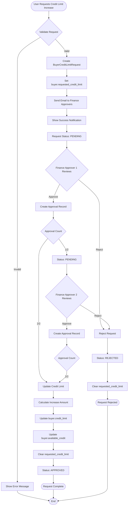

# Credit Limit Request Flow - Complete Documentation

## Table of Contents

1. [System Overview](#system-overview)
2. [Architecture & Components](#architecture--components)
3. [Complete Workflow](#complete-workflow)
4. [User Roles & Permissions](#user-roles--permissions)
5. [Step-by-Step User Guides](#step-by-step-user-guides)
6. [Technical Implementation](#technical-implementation)
7. [Database Schema](#database-schema)
8. [Email Notifications](#email-notifications)
9. [API Reference](#api-reference)
10. [Troubleshooting](#troubleshooting)

---

## System Overview

The Credit Limit Approval System enables buyers to request credit limit increases through a structured dual-approval workflow. The system ensures proper financial controls by requiring two designated finance approvers to approve requests before credit limits are updated.

### Key Features

- **Dual Approval Requirement**: Two finance approvers must approve each request
- **Email Notifications**: Automatic email alerts to finance approvers when requests are created
- **Audit Trail**: Complete tracking of all requests, approvals, and rejections
- **Credit Management**: Automatic calculation and update of available credit
- **Role-Based Access**: Only designated finance approvers can approve requests

### Key Concepts

- **Active Credit Limit** (`credit_limit`): The approved credit limit that is currently active. This only changes when a request is fully approved.
- **Available Credit** (`available_credit`): The current amount of credit available to the buyer. This is reduced when orders are confirmed and restored when orders are cancelled.
- **Requested Credit Limit** (`requested_credit_limit`): The amount requested in a pending credit limit increase request.

---

## Architecture & Components

### System Components

```
┌─────────────────────────────────────────────────────────────┐
│                    Credit Limit System                      │
├─────────────────────────────────────────────────────────────┤
│                                                             │
│  ┌──────────────────┐      ┌──────────────────────────┐   │
│  │  Buyer Model     │      │ BuyerCreditLimitRequest  │   │
│  │  (Company)       │◄─────┤ Model                    │   │
│  │                  │      │                          │   │
│  │ - credit_limit   │      │ - current_limit          │   │
│  │ - available_credit│      │ - requested_limit        │   │
│  │ - requested_     │      │ - status                 │   │
│  │   credit_limit   │      │ - requested_by_id       │   │
│  └──────────────────┘      └──────────────────────────┘   │
│         │                            │                     │
│         │                            │                     │
│         │                            ▼                     │
│         │                  ┌──────────────────────────┐  │
│         │                  │ BuyerCreditLimitRequest   │  │
│         │                  │ Approval Model            │  │
│         │                  │                          │  │
│         │                  │ - user_id                │  │
│         │                  │ - approved_at            │  │
│         │                  │ - notes                  │  │
│         │                  └──────────────────────────┘  │
│         │                                                  │
│         ▼                                                  │
│  ┌──────────────────┐                                     │
│  │  Filament UI     │                                     │
│  │                  │                                     │
│  │ - BuyerResource  │                                     │
│  │ - RequestResource│                                     │
│  │ - OverviewResource│                                    │
│  └──────────────────┘                                     │
│         │                                                  │
│         ▼                                                  │
│  ┌──────────────────┐                                     │
│  │  Email System    │                                     │
│  │                  │                                     │
│  │ - Mailable       │                                     │
│  │ - Template       │                                     │
│  └──────────────────┘                                     │
└─────────────────────────────────────────────────────────────┘
```

### Data Flow

```
Request Creation
    │
    ├─► Create BuyerCreditLimitRequest (status: PENDING)
    ├─► Set buyer.requested_credit_limit
    ├─► Send email to finance approvers
    └─► Show success notification

First Approval
    │
    ├─► Create BuyerCreditLimitRequestApproval
    ├─► Request status remains PENDING
    └─► Show notification (1/2 approvals)

Second Approval
    │
    ├─► Create BuyerCreditLimitRequestApproval
    ├─► Check approval count >= 2
    ├─► Update buyer.credit_limit
    ├─► Update buyer.available_credit (increase by delta)
    ├─► Clear buyer.requested_credit_limit
    ├─► Update request status to APPROVED
    └─► Show success notification

Rejection (Alternative)
    │
    ├─► Set request status to REJECTED
    ├─► Record rejected_by_id, rejected_at, rejected_reason
    ├─► Clear buyer.requested_credit_limit
    └─► Show rejection notification
```

---

## Complete Workflow

### Workflow Diagram



### Detailed Workflow Steps

#### Phase 1: Request Creation

1. **User Initiates Request**
   - Navigates to buyer detail page OR edits buyer form
   - Enters requested credit limit (must be > current active limit)
   - Submits request

2. **System Processing**
   - Validates requested limit > current active limit
   - Creates `BuyerCreditLimitRequest` record with status `PENDING`
   - Sets `buyer.requested_credit_limit` field
   - Queries finance approvers via `TeamMemberService::getFinanceApprovers()`
   - Sends email notification to all finance approvers
   - Shows success notification to requester

3. **Database Changes**
   ```sql
   INSERT INTO buyer_credit_limit_requests (
     team_id, buyer_id, current_limit, requested_limit,
     status, requested_by_id
   ) VALUES (...);
   
   UPDATE companies SET requested_credit_limit = ? WHERE id = ?;
   ```

#### Phase 2: First Approval

1. **Finance Approver 1 Reviews**
   - Receives email notification
   - Clicks "Review Request" link → navigates to Credit Limit Requests page
   - Reviews request details
   - Clicks "Approve" button

2. **System Processing**
   - Validates user can approve (is finance approver, hasn't approved yet, request is pending)
   - Creates `BuyerCreditLimitRequestApproval` record
   - Checks approval count (now 1/2)
   - Request status remains `PENDING`
   - Shows notification: "Your approval has been recorded. One more approval is needed."

3. **Database Changes**
   ```sql
   INSERT INTO buyer_credit_limit_request_approvals (
     buyer_credit_limit_request_id, user_id, approved_at, notes
   ) VALUES (...);
   ```

#### Phase 3: Second Approval

1. **Finance Approver 2 Reviews**
   - Receives email notification (or sees request in list)
   - Reviews request details
   - Clicks "Approve" button

2. **System Processing**
   - Validates user can approve
   - Creates `BuyerCreditLimitRequestApproval` record
   - Checks approval count (now 2/2)
   - **Triggers credit limit update**:
     - Calculates increase amount: `requested_limit - current_limit`
     - Updates `buyer.credit_limit` = `requested_limit`
     - Updates `buyer.available_credit` = `current_available_credit + increase_amount`
     - Ensures `available_credit` doesn't exceed `credit_limit`
     - Clears `buyer.requested_credit_limit` = `NULL`
   - Updates request status to `APPROVED`
   - Shows notification: "Credit limit has been updated. The request is now fully approved."

3. **Database Changes**
   ```sql
   INSERT INTO buyer_credit_limit_request_approvals (...);
   
   UPDATE companies SET
     credit_limit = ?,
     available_credit = ?,
     requested_credit_limit = NULL
   WHERE id = ?;
   
   UPDATE buyer_credit_limit_requests SET status = 'approved' WHERE id = ?;
   ```

#### Phase 4: Rejection (Alternative Path)

1. **Finance Approver Rejects**
   - Reviews request
   - Clicks "Reject" button
   - Enters rejection reason (required)

2. **System Processing**
   - Validates user can reject (is finance approver, request is pending)
   - Updates request status to `REJECTED`
   - Records `rejected_by_id`, `rejected_at`, `rejected_reason`
   - Clears `buyer.requested_credit_limit` = `NULL`
   - Shows rejection notification

3. **Database Changes**
   ```sql
   UPDATE buyer_credit_limit_requests SET
     status = 'rejected',
     rejected_by_id = ?,
     rejected_at = ?,
     rejected_reason = ?
   WHERE id = ?;
   
   UPDATE companies SET requested_credit_limit = NULL WHERE id = ?;
   ```

---

## User Roles & Permissions

### Role Definitions

#### Requester (Any User)
- Can create credit limit increase requests
- Can view their own requests
- Cannot approve or reject requests

#### Finance Approver
- **Requirements**:
  - Must have Central Purchasing Role = Finance
  - Must have `is_approver` flag = `true` in team membership
- **Permissions**:
  - Can approve pending requests (if not already approved by them)
  - Can reject pending requests
  - Can view all credit limit requests
  - Can view approval notes

#### Finance User (Non-Approver)
- Has Finance role but `is_approver` = `false`
- Can view credit limit requests
- **Cannot** approve or reject requests
- Receives email notifications but cannot take action

### Permission Matrix

| Action | Requester | Finance Approver | Finance Non-Approver | Admin |
|--------|-----------|-----------------|---------------------|-------|
| Create Request | ✅ | ✅ | ✅ | ✅ |
| View Requests | ✅ | ✅ | ✅ | ✅ |
| Approve Request | ❌ | ✅ | ❌ | ✅ |
| Reject Request | ❌ | ✅ | ❌ | ✅ |
| View Approval Notes | ✅ | ✅ | ✅ | ✅ |
| Designate Approvers | ❌ | ❌ | ❌ | ✅ |

---

## Step-by-Step User Guides

### For Requesters: Creating a Credit Limit Increase Request

#### Method 1: From Buyer Detail Page

1. Navigate to **Buyers** in the main menu
2. Select the buyer for whom you want to request a credit limit increase
3. Click the **"Request Credit Limit Increase"** button in the header actions
4. In the modal:
   - Review the **Current Active Limit** shown in helper text
   - Enter the **Requested Credit Limit** (must be greater than current limit)
   - Click **Submit**
5. You will see a success notification confirming the request has been submitted

#### Method 2: From Buyer Edit Form

1. Navigate to **Buyers** → Select buyer → Click **Edit**
2. Scroll to the **Credit Settings** section
3. Enter a value in the **Requested Credit Limit** field
   - The field only appears if there is no pending request
   - Minimum value must be greater than the current Active Credit Limit
4. Click **Save**
5. The system automatically creates a credit limit increase request

### For Administrators: Designating Finance Approvers

1. Navigate to **Members** in the main menu
2. Find the team member who has the **Finance** role
3. Click **Edit** to open the member edit form
4. In the **Central Purchasing Role** section:
   - Ensure **Central Purchasing Role** is set to **Finance**
   - Toggle the **"Is Approver"** field to **Yes**
5. Click **Save**

**Important Notes**:
- You need at least **two finance approvers** for the system to work
- The "Is Approver" field only appears when Central Purchasing Role is Finance
- If a user's role changes from Finance, the approver designation is automatically cleared

### For Finance Approvers: Approving Requests

1. **Receive Notification**
   - Check your email for the credit limit increase request notification
   - Click the **"Review Request"** link in the email

2. **Review Request**
   - You'll be taken to the **Credit Limit Requests** page
   - Find the pending request you want to approve
   - Review the details:
     - Buyer name and code
     - Current active limit
     - Requested limit
     - Increase amount
     - Requester name

3. **Approve Request**
   - Click the **Approve** button (green checkmark icon)
   - In the approval modal:
     - Optionally add **Notes** about your approval decision
     - Click **Approve**
   - You'll see a notification:
     - If first approval: "Your approval has been recorded. One more approval is needed."
     - If second approval: "Credit limit has been updated. The request is now fully approved."

4. **View Approval Status**
   - Check the **Approvals** column to see approval count (e.g., "1/2")
   - Click **Approval Notes** button to view all approval details

### For Finance Approvers: Rejecting Requests

1. Navigate to **Finance** → **Credit Limit Requests**
2. Find the pending request you want to reject
3. Click the **Reject** button (red X icon)
4. In the rejection modal:
   - Enter a **Rejection Reason** (required)
   - Click **Reject**
5. The request will be immediately rejected and the buyer's requested credit limit field will be cleared

### Viewing Credit Limit Requests

1. Navigate to **Finance** → **Credit Limit Requests**
2. View the list of all requests with:
   - Buyer information
   - Current and requested limits
   - Status (Pending/Approved/Rejected)
   - Approval count
   - Approvers who have approved
   - Requested by and date
3. Use filters to:
   - Filter by status
   - Filter by buyer
   - Filter by requester
4. Click **Approval Notes** button to view detailed approval information

### Viewing Buyer Credit Limits Overview

1. Navigate to **Finance** → **Buyer Credit Limits**
2. View all buyers with their credit information:
   - Active Credit Limit
   - Available Credit
   - Credit Used
   - Requested Limit (if pending)
   - On Hold status
3. Use filters:
   - Filter by On Hold status
   - Filter by Has Pending Request
4. Sort by any column (default: Available Credit descending)

---

## Technical Implementation

### Models

#### BuyerCreditLimitRequest Model

**Location**: `app/Models/BuyerCreditLimitRequest.php`

**Key Methods**:

```php
// Check if user can approve
public function canBeApprovedBy(User $user): bool

// Check if user can reject
public function canBeRejectedBy(User $user): bool

// Approve request
public function approve(User $user, ?string $notes = null): void

// Reject request
public function reject(User $user, string $reason): void

// Get approval count
public function approvalCount(): int

// Check if fully approved
public function isApproved(): bool
```

**Relationships**:
- `belongsTo(Company::class, 'buyer_id')` → `buyer()`
- `belongsTo(User::class, 'requested_by_id')` → `requestedBy()`
- `belongsTo(User::class, 'rejected_by_id')` → `rejectedBy()`
- `belongsToMany(User::class)` → `approvers()`
- `hasMany(BuyerCreditLimitRequestApproval::class)` → `approvals()`

#### Company Model Updates

**Location**: `app/Models/Company.php`

**New Fields**:
- `available_credit` (decimal 15,2) - Current available credit
- `requested_credit_limit` (decimal 15,2, nullable) - Pending request amount

**New Methods**:
- `creditLimitRequests()` - HasMany relationship to requests
- `pendingCreditLimitRequest()` - Get current pending request

### Filament Resources

#### BuyerCreditLimitRequestResource

**Location**: `app/Filament/Resources/BuyerCreditLimitRequestResource.php`

**Pages**:
- `ListCreditLimitRequests` - List all requests

**Table Columns**:
- Buyer (name, code)
- Current Limit
- Requested Limit
- Increase Amount
- Status (badge)
- Approval Count (X/2)
- Approvers (list)
- Requested By
- Requested At

**Actions**:
- Approve (with notes)
- Reject (with reason)
- View Approval Notes

**Filters**:
- Status
- Buyer
- Requested By

#### BuyerCreditLimitOverviewResource

**Location**: `app/Filament/Resources/BuyerCreditLimitOverviewResource.php`

**Pages**:
- `ListBuyerCreditLimits` - Overview of all buyers

**Table Columns**:
- Buyer (name, code)
- Active Credit Limit
- Available Credit
- Credit Used
- Requested Limit (if pending)
- On Hold status
- Last Updated

**Filters**:
- On Hold
- Has Pending Request

### Services

#### TeamMemberService

**Location**: `app/Services/TeamMemberService.php`

**Key Method**:

```php
/**
 * Get finance role users who are marked as approvers.
 */
public static function getFinanceApprovers(Team $team): Collection
```

This method filters users by:
- Team membership
- Central Purchasing Role = Finance
- `is_approver` = true

---

## Database Schema

### Tables

#### `buyer_credit_limit_requests`

```sql
CREATE TABLE buyer_credit_limit_requests (
    id BIGINT PRIMARY KEY,
    team_id BIGINT NOT NULL,
    buyer_id BIGINT NOT NULL,
    current_limit DECIMAL(15,2) NOT NULL,
    requested_limit DECIMAL(15,2) NOT NULL,
    status VARCHAR(20) DEFAULT 'pending',
    requested_by_id BIGINT NOT NULL,
    rejected_by_id BIGINT NULL,
    rejected_at TIMESTAMP NULL,
    rejected_reason TEXT NULL,
    created_at TIMESTAMP,
    updated_at TIMESTAMP,
    
    FOREIGN KEY (team_id) REFERENCES teams(id) ON DELETE CASCADE,
    FOREIGN KEY (buyer_id) REFERENCES companies(id) ON DELETE CASCADE,
    FOREIGN KEY (requested_by_id) REFERENCES users(id) ON DELETE CASCADE,
    FOREIGN KEY (rejected_by_id) REFERENCES users(id) ON DELETE SET NULL,
    
    INDEX idx_team_status (team_id, status),
    INDEX idx_buyer_status (buyer_id, status),
    INDEX idx_requested_by (requested_by_id)
);
```

#### `buyer_credit_limit_request_approvals`

```sql
CREATE TABLE buyer_credit_limit_request_approvals (
    id BIGINT PRIMARY KEY,
    buyer_credit_limit_request_id BIGINT NOT NULL,
    user_id BIGINT NOT NULL,
    approved_at TIMESTAMP NOT NULL,
    notes TEXT NULL,
    created_at TIMESTAMP,
    updated_at TIMESTAMP,
    
    FOREIGN KEY (buyer_credit_limit_request_id) 
        REFERENCES buyer_credit_limit_requests(id) ON DELETE CASCADE,
    FOREIGN KEY (user_id) REFERENCES users(id) ON DELETE CASCADE,
    
    UNIQUE KEY buyer_credit_limit_request_approvals_unique 
        (buyer_credit_limit_request_id, user_id),
    INDEX idx_user_id (user_id)
);
```

#### `companies` Table Updates

```sql
ALTER TABLE companies ADD COLUMN available_credit DECIMAL(15,2) DEFAULT 0;
ALTER TABLE companies ADD COLUMN requested_credit_limit DECIMAL(15,2) NULL;
```

#### `team_user` Table Updates

```sql
ALTER TABLE team_user ADD COLUMN is_approver BOOLEAN DEFAULT FALSE;
```

### Enums

#### CreditLimitRequestStatus

**Location**: `app/Enums/CreditLimitRequestStatus.php`

```php
enum CreditLimitRequestStatus: string
{
    case PENDING = 'pending';
    case APPROVED = 'approved';
    case REJECTED = 'rejected';
}
```

---

## Email Notifications

### Email Template

**Location**: `resources/views/emails/credit-limit-increase-request.blade.php`

**Mailable Class**: `app/Mail/Erp/CreditLimitIncreaseRequestMail.php`

### Email Content

The email includes:
- **Subject**: "Credit Limit Increase Request: [Buyer Name]"
- **Buyer Information**: Name and code
- **Current Active Limit**: Formatted with currency
- **Requested Limit**: Formatted with currency
- **Increase Amount**: Calculated difference
- **Requester**: User who created the request
- **Request Date**: When the request was created
- **Review Link**: Button linking to Credit Limit Requests page

### Email Recipients

Emails are sent to:
- All users with Finance role AND `is_approver` = `true`
- Retrieved via `TeamMemberService::getFinanceApprovers($team)`

### Email Sending Process

1. Request is created
2. System queries finance approvers
3. For each approver:
   - Extracts email address
   - Uses `EmailTemplateService::sendWithTeamSettings()`
   - Sends `CreditLimitIncreaseRequestMail` instance
4. Errors are logged but don't block request creation

---

## API Reference

### BuyerCreditLimitRequest Model Methods

#### `approve(User $user, ?string $notes = null): void`

Approves the request by a user.

**Parameters**:
- `$user`: The user approving the request
- `$notes`: Optional notes about the approval

**Behavior**:
- Validates user can approve
- Creates approval record
- If 2 approvals exist, updates buyer credit limit
- Uses database transaction with lock

**Throws**: `\Exception` if user cannot approve

#### `reject(User $user, string $reason): void`

Rejects the request.

**Parameters**:
- `$user`: The user rejecting the request
- `$reason`: Required rejection reason

**Behavior**:
- Validates user can reject
- Updates request status to REJECTED
- Records rejection details
- Clears buyer's requested_credit_limit
- Uses database transaction

**Throws**: `\Exception` if user cannot reject

#### `canBeApprovedBy(User $user): bool`

Checks if a user can approve this request.

**Returns**: `true` if:
- Request status is PENDING
- User is a finance approver
- User hasn't already approved

#### `canBeRejectedBy(User $user): bool`

Checks if a user can reject this request.

**Returns**: `true` if:
- Request status is PENDING
- User is a finance approver

#### `approvalCount(): int`

Returns the current number of approvals for this request.

#### `isApproved(): bool`

Returns `true` if the request has 2 or more approvals.

### TeamMemberService Methods

#### `getFinanceApprovers(Team $team): Collection`

Returns a collection of users who:
- Belong to the team
- Have Central Purchasing Role = Finance
- Have `is_approver` = `true`

**Returns**: `Collection<int, User>`

---

## Troubleshooting

### Common Issues

#### Issue: "Request Credit Limit Increase" button not visible

**Possible Causes**:
- There's already a pending request for this buyer
- User doesn't have permission to edit buyers

**Solution**:
- Check if buyer has a pending request: `BuyerResource` → Credit Settings
- If pending request exists, wait for approval/rejection or cancel existing request
- Verify user permissions

#### Issue: Cannot approve a request

**Possible Causes**:
- User is not a finance approver
- User has already approved this request
- Request is not in PENDING status

**Solution**:
- Verify user has Finance role AND `is_approver` = `true`
- Check request status in Credit Limit Requests page
- Verify user hasn't already approved (check Approval Notes)

#### Issue: Email notifications not received

**Possible Causes**:
- No finance approvers designated
- Email address incorrect
- Email service configuration issue

**Solution**:
1. Verify finance approvers exist: Check Members → Finance role → Is Approver = Yes
2. Verify email addresses in user profiles
3. Check email service configuration
4. Review Laravel logs: `storage/logs/laravel.log`

#### Issue: Credit limit not updating after two approvals

**Possible Causes**:
- Both approvals from same user (shouldn't be possible due to unique constraint)
- Database transaction issue
- Approval count not refreshing

**Solution**:
1. Check approval records: View Approval Notes button
2. Verify two different users approved
3. Check database directly:
   ```sql
   SELECT COUNT(*) FROM buyer_credit_limit_request_approvals 
   WHERE buyer_credit_limit_request_id = ?;
   ```
4. Review Laravel logs for errors

#### Issue: Available credit calculation incorrect

**Possible Causes**:
- Available credit not updated correctly on approval
- Order confirmation/cancellation affecting available credit

**Solution**:
1. Verify approval logic: `available_credit = old_available_credit + (requested_limit - current_limit)`
2. Check buyer orders: Confirm/cancel operations affect available credit
3. Review `BuyerOrder::confirm()` and `BuyerOrder::cancel()` methods

### Database Queries for Debugging

#### Check pending requests
```sql
SELECT * FROM buyer_credit_limit_requests 
WHERE status = 'pending' AND team_id = ?;
```

#### Check approvals for a request
```sql
SELECT u.name, u.email, a.approved_at, a.notes
FROM buyer_credit_limit_request_approvals a
JOIN users u ON a.user_id = u.id
WHERE a.buyer_credit_limit_request_id = ?;
```

#### Check finance approvers
```sql
SELECT u.id, u.name, u.email, tu.is_approver
FROM users u
JOIN team_user tu ON u.id = tu.user_id
WHERE tu.team_id = ?
  AND tu.role = 'central_purchasing'
  AND tu.central_purchasing_role = 'finance'
  AND tu.is_approver = true;
```

#### Check buyer credit limit fields
```sql
SELECT id, name, credit_limit, available_credit, requested_credit_limit
FROM companies
WHERE id = ? AND is_buyer = true;
```

### Logging

The system logs important events:

- **Request Creation**: Logged in `BuyerResource/Pages/ViewBuyer.php`
- **Email Sending Errors**: Logged with request ID and error message
- **Approval Errors**: Caught and displayed in notifications

Check logs:
```bash
tail -f storage/logs/laravel.log
```

---

## Best Practices

### For Administrators

1. **Designate Multiple Approvers**: Always have at least 2 finance approvers to avoid bottlenecks
2. **Regular Reviews**: Periodically review the Buyer Credit Limits Overview page
3. **Monitor Requests**: Check Credit Limit Requests page regularly for pending requests
4. **Clear Communication**: Ensure approvers understand their responsibilities

### For Finance Approvers

1. **Review Carefully**: Always review request details before approving
2. **Add Notes**: Use approval notes to document reasoning
3. **Timely Response**: Respond to requests promptly to avoid delays
4. **Verify Calculations**: Double-check increase amounts and current limits

### For Requesters

1. **Justify Requests**: Ensure requested amounts are justified by business needs
2. **Check Current Status**: Verify no pending requests exist before creating new ones
3. **Follow Up**: Monitor request status in Credit Limit Requests page
4. **Provide Context**: Use request notes if available to provide context

---

## Related Documentation

- [Testing Emails with Mailpit](./testing-emails-with-mailpit.md)
- [Credit Limit Approval User Guide](./credit-limit-approval-guide.md) (if exists)

---

## Version History

- **v1.0** (2026-02-03): Initial implementation
  - Dual approval workflow
  - Email notifications
  - Finance approver designation
  - Credit limit automatic updates

---

## Support

For technical issues or questions:
1. Check this documentation
2. Review Laravel logs: `storage/logs/laravel.log`
3. Check database records using queries above
4. Contact system administrator
